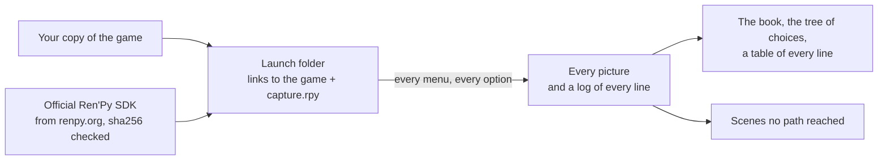

<div align="center">

# renpy-capture

**Every line of a Ren'Py game, in its scene, in every branch — without playing it.**

[](https://github.com/Aiken-Project-A/renpy-capture/actions/workflows/tests.yml)
[](https://github.com/Aiken-Project-A/renpy-capture/blob/main/LICENSE)


**English** · [Русский](https://github.com/Aiken-Project-A/renpy-capture/blob/main/docs/readme/ru.md) · [Українська](https://github.com/Aiken-Project-A/renpy-capture/blob/main/docs/readme/uk.md) · [简体中文](https://github.com/Aiken-Project-A/renpy-capture/blob/main/docs/readme/zh-CN.md) ·
[日本語](https://github.com/Aiken-Project-A/renpy-capture/blob/main/docs/readme/ja.md) · [한국어](https://github.com/Aiken-Project-A/renpy-capture/blob/main/docs/readme/ko.md) · [Español](https://github.com/Aiken-Project-A/renpy-capture/blob/main/docs/readme/es.md) · [Français](https://github.com/Aiken-Project-A/renpy-capture/blob/main/docs/readme/fr.md)


<sub>One moment of The Question, the sample game that ships with Ren'Py, in English and in the Russian translation that
comes with it: two frames drawn by the game's own engine. The artwork is released under the MIT license.</sub>

### [See the live example →](https://aiken-project-a.github.io/renpy-capture/)

</div>

renpy-capture runs a Ren'Py game in its own engine on a hidden screen, answers every menu every way, and keeps the
picture the player sees at every line. What comes out is a small website: read it in a browser, search it, send it to
anyone.

## What you get

<picture>
  <source media="(prefers-color-scheme: dark)" srcset="https://raw.githubusercontent.com/Aiken-Project-A/renpy-capture/main/docs/images/book-dark.jpg">
  
</picture>

- **[The book of the game.](https://aiken-project-a.github.io/renpy-capture/the-question/)** Every line beside the
  picture the player sees, with the speaker and the line of the script. Search it; link to any line.
- **[The tree of choices.](https://aiken-project-a.github.io/renpy-capture/the-question/choices.html)** Every menu and
  every option, down to how each path ends; each option opens its moment in the book.
- **[The translation beside the original.](https://aiken-project-a.github.io/renpy-capture/the-question-ru/)** For a
  game that already has a translation (`game/tl/<language>`): every translated line as the game itself draws it, in
  its own dialogue window, beside the original. Does the text fit, does the font have the letters. renpy-capture shows
  translations; it does not make them.
- **Proof that nothing was missed.** After the capture the game's scripts are read, and every scene no path reached
  is named, with its label, file and line.

## Who it's for

| You are | It gives you |
|---|---|
| **Translators** | Every line with its context: who speaks, what is on screen, what came before. |
| **Editors and proofreaders** | The whole translation as the game shows it, behind one link: nothing to install, no routes to replay. |
| **Authors and testers** | Every route in one run: see a line that overflows the window or a missing picture, find the branches no player can reach, compare two builds line by line. |
| **Guide and wiki writers** | The tree of choices with every ending, and a picture for every step. |
| **Language learners** | A game you love and its translation as a bilingual book, line by line. |
| **Reviewers and archivists** | Every scene of every branch without playing: before an age rating, for research, to keep a game readable. |

## Try it

```sh
pipx install renpy-capture
renpy-capture capture ~/Games/SomeGame work/
xdg-open work/export/index.html
```

One command does the whole job: it fetches the official Ren'Py SDK of the game's version, plays every branch on a
hidden screen, looks for scenes no branch reached, and writes the pages. Run it again to go on after an interruption.
The Question takes six seconds; a large commercial game of 22,000 lines, about eight minutes.

A translation the game already has in `game/tl/russian`: capture the original and the translation, both with the
game's dialogue window, and open the translation's book, where the original stands beside every line.

```sh
renpy-capture capture ~/Games/SomeGame work/ --text
renpy-capture capture ~/Games/SomeGame work/ --text --language russian
xdg-open work/export-text-russian/index.html
```

> [!NOTE]
> Linux or Windows 10/11, with Python 3.9 or newer. On Linux, KWin or Xvfb for the hidden screen; on Windows the game
> runs on a desktop of its own and nothing shows on yours (on Windows, open the page with `start` instead of
> `xdg-open`). See [the guide](https://github.com/Aiken-Project-A/renpy-capture/blob/main/docs/guide.md#on-windows).

## Why you can trust the pictures

- **The game's own engine draws them.** The official Ren'Py SDK of the game's version runs the game: its fonts,
  transitions, layered images, animations and screens. Nothing is rebuilt from the script.
- **Every branch, then a check.** Every menu is answered every way; then the scripts are read, and any scene no path
  reached is named.
- **The same picture, every time.** Game time follows frames, not the clock; randomness is seeded; a scene is kept
  once it has settled. Run it twice and the files are identical, so a difference between two captures is a real one.
- **Your copy stays untouched.** The game runs from a separate folder that only links to it; the SDK comes from
  renpy.org and is checked against its official checksum.

Tested on a large commercial game: 44 branches and 21,945 lines in about eight minutes on four engines, every picture
identical, byte for byte, to the run before.

## Compared with what you do now

| | Playing through | Translation files and tools | renpy-capture |
|---|:---:|:---:|:---:|
| Each line in its scene | ✓ | — | ✓ |
| Every branch, and proof that none was missed | by hand, route by route | every string, reachable or not | ✓ |
| The translation beside the original | replay in each language | text only | ✓ frame beside frame, as the game draws it |
| Search, a link to any line, one page to share | — | search | ✓ |
| Editing the translation | — | ✓ | — |

renpy-capture does not replace your translation tools: it shows what they produce, in the game.

## Good to know

- It answers menus; it does not play mini-games. A map, a quiz or a timed challenge can be guided by the game's
  config, see [the guide](https://github.com/Aiken-Project-A/renpy-capture/blob/main/docs/guide.md#games-that-need-help).
- The official SDK has to run the game: a game shipped with a modified engine may not start.

<details>
<summary><b>How it works</b></summary>



- Inside the engine, a small script takes the picture once the scene has settled: animations and transitions are
  over and nothing asks for a redraw any more. An endless animation is caught at a fixed phase.
- A job plays the game from a label and answers menus with the options it was given. Every option not taken yet
  becomes a new job, until none is left; several engines run at once, and a watchdog restarts one that hangs.
- Mods that draw over the game are left out of the launch folder, so the pictures are the game's own.

</details>

## More

- **[The guide](https://github.com/Aiken-Project-A/renpy-capture/blob/main/docs/guide.md)**: installing, the hidden screen, translations, every command, what each file holds,
  games that need help, when something is off.
- [The config](https://github.com/Aiken-Project-A/renpy-capture/blob/main/docs/config.md) and [the output](https://github.com/Aiken-Project-A/renpy-capture/blob/main/docs/output.md), field by field · [Changelog](https://github.com/Aiken-Project-A/renpy-capture/blob/main/CHANGELOG.md)

## Be kind to the authors

Capture games you own. The pictures and the words are their authors' work: do not publish them without permission.

## License

MIT, see [LICENSE](https://github.com/Aiken-Project-A/renpy-capture/blob/main/LICENSE). Made by Aiken and Claude.
