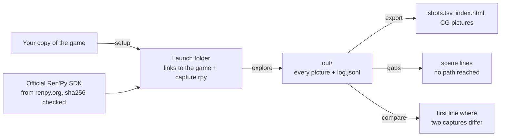

# The guide

Everything the [front page](../README.md) leaves out: how to install, what each command does, what the files hold,
how to guide a game with more machinery, and what to do when something is off.

- [Install](#install)
- [On Windows](#on-windows)
- [The window](#the-window)
- [The Windows build](#the-windows-build)
- [Capture a game](#capture-a-game)
- [A translation](#a-translation)
- [Step by step](#step-by-step)
- [What you get](#what-you-get)
- [The progress a program can read](#the-progress-a-program-can-read)
- [How it works](#how-it-works)
- [Games that need help](#games-that-need-help)
- [When something is off](#when-something-is-off)
- [Limits](#limits)
- [Tested on](#tested-on)
- [Tests](#tests)

## Install

You need Linux or Windows 10/11 (see [On Windows](#on-windows)), Python 3.9 or newer, and on Linux a screen for the
engine. The first one available is used; `--display` picks one:

- `kwin` — a virtual KDE Plasma 6 compositor (`kwin_wayland --virtual`) with its own D-Bus session: nothing appears
  on your desktop, the engine renders on the GPU;
- `xvfb` — a virtual X server (`Xvfb`): nothing appears on your desktop, the engine renders in software (Mesa);
- `window` — your own desktop: the game window is visible while the capture runs; leave it alone.

```sh
pipx install renpy-capture
# or, inside a virtual environment: pip install renpy-capture
# the latest from GitHub, before its release: pipx install git+https://github.com/Aiken-Project-A/renpy-capture
```

No terminal, no Python? On Windows there is [a zip that needs nothing installed](#the-windows-build), and anywhere with
Python and Tk [a window](#the-window): `renpy-capture gui`.

SDKs are kept in `~/.cache/renpy-capture/sdk`, on Windows in `%LOCALAPPDATA%\renpy-capture\sdk`
(`RENPY_CAPTURE_SDK` puts them elsewhere).

For games that ship only compiled scripts (`.rpyc`), the check for unreached lines and the scene names of the page
read them with [unrpyc](https://github.com/CensoredUsername/unrpyc) (MIT): renpy-capture downloads a pinned release
once from GitHub and checks its files, or uses your own copy when `RENPY_CAPTURE_UNRPYC` points to it.

## On Windows

Windows 10 or 11, Python 3.9 or newer from [python.org](https://www.python.org/downloads/windows/) (or the Microsoft
Store), then in PowerShell or the Command Prompt:

```powershell
py -m pip install --user pipx
py -m pipx ensurepath          # then open a new terminal
pipx install renpy-capture
renpy-capture capture "D:\Games\SomeGame" work
start work\export\index.html
```

Everything else is the same as on Linux: the commands, the config, the files a capture writes. What differs:

- **What you see.** By default (`--display desktop`) the engine draws on a desktop of its own: nothing appears on
  your screen and you can go on working, the taskbar shows nothing either. `--display offscreen` keeps the window on
  your desktop but beyond the edge of the screen (it shows for a moment each time the engine starts, and in the
  taskbar). `--display window` leaves it in the middle of your screen: leave it alone. On the tests' machine the three
  give the same frames, to the byte.
- **The size of the pictures.** Ren'Py makes its window no larger than the screen it opens on, less a margin of
  about 100 pixels, and scales it with Windows' display scaling. A game of 1920x1080 on a 1920x1080 screen is captured
  a little smaller than its own size; at 125% scaling, larger. The pictures are the same scene either way, and
  `compare --states-only` compares captures of different sizes.
- **The launch folder** is made of hard links to the game's files (symbolic links need an administrator or Developer
  Mode on Windows): they take no room, and the game is never written to. A hard link needs the same drive and NTFS:
  with the game on another drive, or on a USB stick, the files are copied once, which takes room and time; renpy-capture
  says so. Put the work folder on the drive of the game.
- **The graphics.** The engine picks its renderer as it does for a player: OpenGL when the driver offers it, else
  ANGLE (OpenGL ES over Direct3D 11). `--gpu` does nothing on Windows: Settings → System → Display → Graphics chooses
  the GPU of `renpy.exe` in the SDK. Pictures made with another renderer than on Linux may differ in pixels, never in
  what is on screen: `compare --states-only`.
- **Stopping.** Ctrl+C, closing the terminal or ending renpy-capture in the Task Manager stops the engine too, and
  anything it started (a Job Object).
- **Saves and settings** of the engine stay in the launch folder (`run\home`), as on Linux: your own saves of the game
  are not touched, and an error opens no editor.
- A game with Live2D: its `lib\py3-windows-x86_64\Live2DCubismCore.dll` is used (the SDK has none).

## The window

For a person who does not use a terminal. It does what `capture` does, and every choice in it is an argument of the
command:

| In the window | The command |
|---|---|
| **Game folder**, with *Browse…*: the folder with `game/` inside, `game/` itself, or a folder around them | `GAME` |
| **Work folder**: by default a folder named after the game in `Documents\renpy-capture` | `WORKDIR` |
| **Translation to capture**: *The original* and the folders of the game's `game/tl` | `--language NAME` |
| **Show the text box in the pictures** | `--text` |
| **Ren'Py version**, asked only when the game does not tell which one made it: the versions tried with this tool, newest first | `--renpy-version` |
| **Capture** | `renpy-capture capture …` |

It comes with the [zip for Windows](#the-windows-build) (`renpy-capture-gui.exe`); with Python it is `renpy-capture gui`
(or `renpy-capture-gui`, which opens no console on Windows), and needs Tk: `sudo apt install python3-tk` on Debian and
Ubuntu, "tcl/tk and IDLE" in the installer of Python on Windows.

- **The folders.** A folder that is not a game is said so, in words ("there is no `game` folder with .rpy, .rpyc or .rpa
  files in it"); several games in one folder are named. The work folder cannot hold the game or be inside it, and a
  folder that already holds the capture of *another* game is refused (that would mix two). A folder with other files in
  it is asked about first; one on another drive than the game is said to mean copies instead of links (see
  [On Windows](#on-windows)). Documents is not used when OneDrive keeps it in sync (the launch folder links every file
  of
  the game, and OneDrive would upload them all): the home folder is.
- **While it runs.** The window starts `renpy-capture capture … --progress-json` as a program of its own and words what
  it
  reads, refreshed every second: the engine being downloaded the first time (with its size), unpacked, then the
  branches done out of those found so far, the lines captured, the branch under way, and the time. What the command
  prints goes to the pane at the bottom (selectable, copyable) and to `renpy-capture.log` in the work folder, which
  every run adds to (*Open the log*).
- **Cancel** stops the capture and everything it started. On Windows the window keeps the capture in a Job Object (the
  engines are in the capture's own, inside it), so nothing outlives it, not even when the window is killed; elsewhere it
  sends SIGTERM, which the capture turns into the stop it makes on Ctrl+C (the engine and the virtual screen are
  stopped first), and SIGKILL after 20 seconds. What was captured is kept: **Capture** again goes on where it stopped.
- **At the end:** what was captured (branches, lines, pictures), what to look at in plain words (branches that stopped
  on an error in the game's own script, scenes no branch reached, a capture that waited for animations, a slow
  engine), a hint when a translation was captured without its original, and **Open the page** (the export's
  `index.html`), **Open the folder**, **Open the log**.
- **Remembered:** the last folders and choices, for each game, and the size of the window, in `gui.json` in
  `%APPDATA%\renpy-capture` (`~/.config/renpy-capture` elsewhere). An error inside the window is written down in
  `window-errors.log` there, and told once.
- **The keyboard** reaches everything (Tab, Shift+Tab; Enter on *Capture* starts; Escape asks to cancel a run), the
  window resizes, and every text in it can be selected and copied (click, Ctrl+A, Ctrl+C, or the right button).
- **Words.** It is in English; all of its words are in `renpy_capture/gui/strings.py`, so that they can be translated.
  What it decides (folders into arguments, events into sentences, the end of a run into a summary) is in
  `controller.py` and tested without a display; `app.py` is the thin Tk layer. `RENPY_CAPTURE_GUI_AUTORUN=1` makes
  the window press *Capture* by itself and close, with an exit code that says how it went, for trying a build where
  nobody sits ([Tests](#tests)).

## The Windows build

`renpy-capture-<version>-windows-x64.zip`, attached to every [release](https://github.com/Aiken-Project-A/renpy-capture/releases/latest):
unpack it (right-click, *Extract All*; it does not run from inside the zip) and double-click `renpy-capture-gui.exe`.
Python, Tk and Pillow are inside; nothing is installed. What it keeps: the engines it downloads
(`%LOCALAPPDATA%\renpy-capture\sdk`), the choices of the window (`%APPDATA%\renpy-capture`) and the work folders you
choose.

| In the folder `renpy-capture` | |
|---|---|
| `renpy-capture-gui.exe` | the window, with no console: what a double-click is for |
| `renpy-capture.exe` | the command, for a terminal: the same as `renpy-capture` of pip (given no arguments it opens the window too) |
| `_internal\` | what they run on, with `capture.rpy`: keep it next to the programs |
| `README.txt`, `LICENSE`, `THIRD-PARTY.txt` | what to do first, the license, the licenses of Python, Tk and Pillow |

- **SmartScreen.** The build is not signed (there is no certificate), so the first time Windows may show a blue
  *"Windows protected your PC"*. Click **More info**, then **Run anyway**; it asks once. A zip downloaded from the web
  carries a mark that makes Windows ask; `Unblock-File` or *Properties → Unblock* on the zip before unpacking it avoids
  it.
  An antivirus program may look at an unknown program for a moment, or flag it (programs made with PyInstaller are
  flagged more than they should be: the build is one folder rather than one file, which flags less). The source is
  public and the zip is built from it by GitHub.
- **How it is made.** [PyInstaller](https://pyinstaller.org) (a tool of the build only, not a dependency of the package),
  from `packaging/windows/renpy-capture.spec`, in the workflow `windows build`: one folder rather than one file (it
  starts
  faster, and antivirus programs flag it less). `capture.rpy` is data in it (`runner.py` finds it next to itself), the
  pool of processes of `export` works in it (`freeze_support`), and the standard-library modules that the pinned unrpyc
  imports are included, found by reading unrpyc when the build is made: a game that ships only compiled scripts needs no
  Python either. The icon is drawn by `make_icon.py`, the zip packed by `make_zip.py`. To build it yourself, on Windows:

  ```powershell
  pip install pyinstaller==6.22.3 .
  pyinstaller --noconfirm packaging\windows\renpy-capture.spec      # dist\renpy-capture\
  python packaging\windows\make_zip.py                              # dist\renpy-capture-<version>-windows-x64.zip
  ```
- **How it is tried.** On every pull request the workflow builds the zip (an artifact of the run) and
  `packaging/windows/check-build.ps1` tries it on a clean windows-latest the way a person would: the zip is unpacked
  into
  a folder with spaces and non-English letters, `--version` is timed, the window is started and closed, The Question is
  captured with `renpy-capture.exe` and compared with the capture made on Linux, the progress a program can read is
  checked, a game with only compiled scripts is read by unrpyc inside the program, and the window captures The Question
  through the command that stands beside it. What it measures (the size of the build, the start, the capture) is in the
  summary of the run.
- **A release.** Publishing a release builds, tries and attaches the zip to it, once its version is the tag's (the
  workflow can also be run by hand with a tag, for a release made before it existed).

## Capture a game

```sh
renpy-capture capture ~/Games/MyGame work/
xdg-open work/export/index.html
```

`capture` does the whole job in one work folder: a starter config (`work/config.json`, yours to edit), the launch
folder (it downloads the game's Ren'Py SDK once), every option of every menu, a check for scene lines that no branch
reached, and the pages. A line shows how far it is while it runs; at the end it says what to open. Run the same
command again to go on after an interruption, or after editing the config to guide the capture.

Worth knowing: `--workers 4` runs four engines at once (with a GPU and memory to spare); `--fast` draws only the
frames where the capture decides, up to twice as fast on animated games, with animations maybe caught in another
phase; `--renpy-version` when the game does not tell its version; `--gpu mesa` keeps a laptop's discrete GPU asleep.
`renpy-capture capture --help` lists every option.

## A translation

```sh
renpy-capture capture ~/Games/MyGame work/ --text                      # the original, with its dialogue window
renpy-capture capture ~/Games/MyGame work/ --text --language russian   # the translation, from game/tl/russian
xdg-open work/export-text-russian/index.html
```

The second page shows every line of the original with its translation under it and both frames side by side: text
that does not fit the window, a font without the glyphs. Without `--text` the frames show the scenes alone, the same
to the byte in both languages, and `renpy-capture compare work/out work/out-russian` checks that the translation
takes the game the same way.

## Step by step

What `capture` does, command by command, for finer control:

```sh
renpy-capture init    ~/Games/MyGame config.json          # a starter config: one job from `start`
renpy-capture setup   ~/Games/MyGame run/                 # the launch folder (downloads the SDK once)
renpy-capture explore run/ config.json out/               # capture, taking every menu option
renpy-capture gaps    ~/Games/MyGame config.json out/     # scene/show lines no job has reached
renpy-capture export  out/ ~/Games/MyGame export/         # the pages and the table
```

`report` sums a capture up, `compare` checks two captures against each other, `run` and `prun` capture the jobs of a
config as they are (on one engine or several), `forget` drops jobs to capture them again; `--help` after any command
describes it.

## What you get

- `out/frames/<sha1>.png` — every distinct picture, once.
- `out/log.jsonl` — one record per interaction and per job event (see [output.md](output.md)).
- `export/shots.tsv` — every interaction in order: job, step, script file and line, label, statement, speaker
  (variable and name), text, picture, menu options with the one taken, translation id; with `--beside`, the line,
  menu and picture of the other capture too.
- `export/index.html` — the same as a page: jobs as sections, each picture with the lines spoken over it; with
  `--beside`, the other capture's lines under these and its picture next to this one when it differs. A search box
  filters the lines by text, speaker, script line or translation id (`index.html?q=Sylvie` opens with a search).
- `export/choices.html` — the tree of choices: every menu met, the line shown with it and the options taken, each
  one a link to its step on the page, down to where every job ended (a mini-game's menu met again and again is one
  line).
- `export/cg/` and `cg.tsv` — event pictures, when `export --options` names the image files that make one
  ([config.md](config.md#export-options)).

## The progress a program can read

`--progress-json` (on `capture`, `explore`, `run` and `prun`) is how the window follows a capture, and how a script can:
the standard output carries **one JSON object per line**, and everything meant for a person (what the command prints,
and the reason when it stops) goes to the standard error. Both are UTF-8; the JSON lines are plain ASCII. Every object
has an `event`:

| `event` | when | fields |
|---|---|---|
| `stage` | a step begins | `stage`: `setup` (the config and the launch folder), `capture` (every branch), `check` (scenes no branch reached), `export` (the pages) |
| `fetch` | an engine or unrpyc is fetched the first time | `what`: `sdk` or `unrpyc`; `version`; `step`: `download`, `verify`, `unpack`, `done`; `done` and `total`: bytes of a download, files of an unpack (`total` is null when not known) |
| `progress` | every second or two while the engines run | `jobs_done`, `jobs_total` (the branches found so far), `lines`, `now` (the branch under way, null when none or several), `engines` |
| `done` | a `capture` ends well | `lines`, `jobs`, `pictures`; `complete` (every menu option taken); `errors` (branches that stopped on an error in the game's script); `missed` (scene lines no branch reached; null when `unchecked` says why they could not be looked at); `warnings` (`{"kind": "moving" \| "late" \| "slow", …}`); `language`, `text`, `beside`; and the absolute paths `workdir`, `config`, `out`, `export`, `index`, `choices`, `table` |
| `error` | the command is stopping | `message`: the reason, as the standard error says it |

```sh
renpy-capture capture ~/Games/MyGame work/ --progress-json 2> work.log | head -3
{"event":"stage","stage":"setup"}
{"event":"stage","stage":"capture"}
{"event":"fetch","what":"sdk","version":"8.3.2","step":"download","done":0,"total":141063916}
```

The exit code is 0 when the capture ended, and not when the command stopped (an `error` event came before). A capture
told
to stop with SIGTERM ends the way it does on Ctrl+C. An event a program does not know is to be skipped.

## How it works



- Inside the engine, `capture.rpy` takes the picture once the scene has **settled**: one-shot animations have
  finished, transitions are over, and nothing asks for a redraw any more (endless animations are captured at a fixed
  phase). The dialogue window and the game's interface screens are not drawn, so the picture is the scene itself
  (`--text` keeps the window and menus).
- A **job** plays a label as a replay (a fresh game state from `default`, plus the job's own variables) and answers
  menus with the options it was given, the first one otherwise. **`explore`** reads the menus met in the log and adds
  a job for every option not taken yet, until there are none.
- **Repeatable to the byte.** Game time follows a frame counter instead of the wall clock, randomness is seeded from
  the job's name, and timers fire only when the capture lets them: the same config gives the same pictures every
  time, on one engine or on eight (`compare` checks it).
- **The game stays untouched.** The launch folder only links to the game's files, the SDK comes from renpy.org and is
  checked against the official sha256, and the game's own executable is never run.
- **Unattended.** A virtual screen, several engines at once (`explore --workers`), a watchdog that restarts an engine
  whose job hangs, and an interrupted capture goes on where it stopped.
- Mods that players drop into `game/` and that draw over the game (Translator3000, the Universal Ren'Py Mod) are left
  out of the launch folder; `setup --exclude REGEX` leaves out anything else.

## Games that need help

Most visual novels need nothing but the starter config. Games with more machinery can be guided by the config
([config.md](config.md)): mini-games can be skipped with a menu option (`prefer`) or a stub screen
(`stub_screens`), timed mini-games can be left to time out (`ui_timers`, `wait_menus`), map screens can end a scene
(`stop_labels`), effects can be kept out of the picture (`null_images`, `still_transforms`, `hide_tags`), and branches
chosen by flags set much earlier can be captured with exact jobs (`gaps` tells which ones).

A hub, a map or an imagemap the script calls as a screen (`call screen`) needs nothing: its buttons that lead on
(`Return`, `Jump`, `Call`) are the options of a menu, each one becomes a job of its own, and a job ends when it comes
back to the hub. What the Ren'Py Tutorial (the SDK's larger game) taught:

- **Capture a game where it lives.** A game may take files from beside its own folder (the Tutorial adds
  `../launcher/game/fonts` to its search path): renpy-capture looks for them next to the game, so point it to the
  game in place, not to a copy taken out of its surroundings.
- **A mini-game with nothing to press** (the Tutorial's pong, a creator-defined displayable) is not a menu: on its own
  the capture ends it and the game goes on as after a win or a loss, whichever the script takes for `True`. The
  script tells what the screen returns (`if _return == "eileen":`); `stub_screens` returns it, and a job with
  `stub_screens` of its own takes the other outcome:

  ```json
  {"jobs": [{"id": "start", "label": "start"},
            {"id": "pong lost", "label": "demo_minigame", "stub_screens": {"pong": "eileen"}}],
   "ui": ".*", "settle": 0.3, "settle_max": 1.2, "max_steps": 3000, "loop_limit": 40}
  ```

  With this config the Tutorial is captured whole: 39 jobs, 1,652 lines, nothing left unreached.

## When something is off

- **The capture is very slow.** `report` warns about it. If nearly every capture was taken "while something was
  still moving", an overlay never stops animating: a mod or a HUD screen; list its screens in `ui`, its files in
  `drop`, or leave it out with `setup --exclude`. If every interaction takes seconds, the GPU driver may be in a bad
  state (it happens after a laptop's discrete GPU wakes from sleep): `--gpu mesa` or `--display xvfb` still work, a
  reboot brings the GPU back.
- **A laptop's NVIDIA GPU wakes up during a capture.** `--gpu mesa` (or `--display xvfb`) leaves it asleep: the virtual
  screen and the engine get only Mesa's graphics drivers and KWin only the other GPU. With `--gpu auto` KWin may render
  on the NVIDIA GPU and wake it, as any program that draws on it; a system monitor that shows the GPU's load wakes it
  too.
- **Two runs differ.** `compare` shows the first line where the scene differs. Runs on different GPUs or drivers
  differ in pixels only: `compare --states-only`.
- **A job stops early.** `report` tells why: a script error (`ignore_errors` steps over an author's typo), a hub label
  (`stop_labels`), a loop (`loop_limit`), or the watchdog (`--stall`).
- **A timed menu was answered instead of timing out.** `report` warns when `wait_max` had to answer a menu of
  `wait_menus`: the game's timer lives on an interface screen (let it run with `ui_timers`) or needs longer
  (`wait_max`).
- **Something is on screen that should not be, or missing.** `export`'s `index.html` shows every picture; the log
  record of a line lists the images, screens and files that make it (`shown`, `screens`, `files`).

## Limits

- Linux and Windows 10/11; not macOS yet.
- The window is in English (its words are in one file, to be translated), and runs one engine at a time.
- On Windows the pictures are no larger than the screen (see [On Windows](#on-windows)).
- The official SDK must be able to run the game: games that ship a modified engine may not start.
- `gaps` and `export` read `.rpy` sources, `.rpyc` through unrpyc, and archives in the formats Ren'Py itself writes
  (RPA-2.0 and RPA-3.0). The index of an archive is read without running code from it; custom and obfuscated
  archive formats are not supported.

## Tested on

| | |
|---|---|
| **System** | Gentoo Linux, kernel 7.2 · KDE Plasma 6.7 (KWin 6.7.5) · Python 3.14 |
| **Graphics** | NVIDIA GeForce RTX 2060 (driver 615.71) · AMD Radeon Vega (Mesa 26.2, radeonsi) · software rendering (Xvfb 21.1, Mesa llvmpipe) |
| **Ren'Py** | 7.8.7, 8.2.3, 8.3.2, 8.5.3 |
| **The sample game** | The Question: 3 jobs, 128 lines in seconds. The same pictures, byte for byte, on Ren'Py 7.8 and 8.3; the same scene at every line on all three graphics stacks. |
| **Windows** | GitHub Actions windows-latest: Windows Server 2025, Python 3.12, no GPU (Microsoft Hyper-V Video): the engine falls back from OpenGL to ANGLE on the Microsoft Basic Render Driver (Direct3D 11 in software). The Question on Ren'Py 8.3.2 and 7.8.7: the same scene as on Linux at every one of its 128 lines, and the same frames, byte for byte, on the three displays and from run to run, in about the time the jobs take on Linux (16 s against 17 s for 8.3.2). The Torture Test passes too. Not yet on a Windows machine with a GPU. |
| **The Tutorial** | The SDK's larger game, under Xvfb (software rendering, 4 cores): 39 jobs, 1,652 lines, 104 distinct pictures in about 3 minutes, on Ren'Py 7.8.7, 8.3.2 and 8.5.3; nothing left unreached, no warning, a second run the same to the byte. Each SDK ships its own Tutorial, so their captures differ where the games do. |
| **A large commercial game** | 44 jobs, 21,945 lines in about 8 minutes on four engines (RTX 2060). The same pictures, byte for byte, as a reference capture, and the same 591 event pictures. |

## Tests

```sh
python -m unittest discover -s tests -t .                        # unit tests: no engine, no network
RENPY_CAPTURE_IT=1 python -m unittest tests.test_the_question    # end to end on The Question (downloads the SDK once)
RENPY_CAPTURE_IT=1 python -m unittest tests.test_torture         # end to end on the Torture Test (tests/games)
RENPY_CAPTURE_IT_TUTORIAL=1 python -m unittest tests.test_tutorial  # the SDK's Tutorial, a few minutes
RENPY_CAPTURE_IT=1 python -m unittest tests.test_gui_window       # the window on a screen, and The Question through it
```

The window's tests need Tk and a screen (they are skipped without one; on Linux, `xvfb-run -a python -m unittest …`).
`RENPY_CAPTURE_GUI_SHOT=window.png` saves a picture of the window when The Question has been captured through it (what
the README shows). A build is tried with `packaging/windows/check-build.ps1` (see [The Windows
build](#the-windows-build));
`RENPY_CAPTURE_GUI_AUTORUN=1` makes the window press *Capture* by itself and close with an exit code (0: done, 1:
stopped
or failed, 2: nothing to capture), which is how that script has the window run a capture on a machine nobody sits at.

On every pull request GitHub Actions runs the unit tests on Python 3.9 to 3.14 and on Windows, the end-to-end tests
(The Question and the Torture Test) on Ren'Py 8.5.3, 8.3.2 and 7.8.7 under Xvfb on Linux and on 8.3.2 and 7.8.7 on
windows-latest, and the Tutorial on Ren'Py 8.5.3 under Xvfb. The Windows
job compares its capture of The Question with the one made on Linux, line by line (`RENPY_CAPTURE_IT_REFERENCE`), and
its three displays with each other, to the byte. The window is tested under Xvfb on Linux and on Windows (the unit tests
of its controller run everywhere), and the workflow `windows build` builds the zip on every pull request and tries it
(see [The Windows build](#the-windows-build)).
