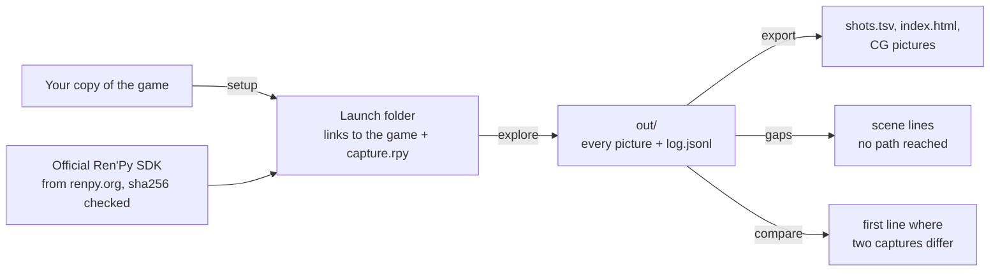

# The guide

Everything the [front page](../README.md) leaves out: how to install, what each command does, what the files hold,
how to guide a game with more machinery, and what to do when something is off.

- [Install](#install)
- [Capture a game](#capture-a-game)
- [A translation](#a-translation)
- [Step by step](#step-by-step)
- [What you get](#what-you-get)
- [How it works](#how-it-works)
- [Games that need help](#games-that-need-help)
- [When something is off](#when-something-is-off)
- [Limits](#limits)
- [Tested on](#tested-on)
- [Tests](#tests)

## Install

You need Linux, Python 3.9 or newer, and a screen for the engine. The first one available is used; `--display` picks
one:

- `kwin` — a virtual KDE Plasma 6 compositor (`kwin_wayland --virtual`) with its own D-Bus session: nothing appears
  on your desktop, the engine renders on the GPU;
- `xvfb` — a virtual X server (`Xvfb`): nothing appears on your desktop, the engine renders in software (Mesa);
- `window` — your own desktop: the game window is visible while the capture runs; leave it alone.

```sh
pipx install git+https://github.com/Aiken-Project-A/renpy-capture
# or, inside a virtual environment: pip install git+https://github.com/Aiken-Project-A/renpy-capture
```

SDKs are kept in `~/.cache/renpy-capture/sdk` (`RENPY_CAPTURE_SDK` puts them elsewhere).

For games that ship only compiled scripts (`.rpyc`), the check for unreached lines and the scene names of the page
read them with [unrpyc](https://github.com/CensoredUsername/unrpyc) (MIT): renpy-capture downloads a pinned release
once from GitHub and checks its files, or uses your own copy when `RENPY_CAPTURE_UNRPYC` points to it.

## Capture a game

```sh
renpy-capture capture ~/Games/MyGame work/
xdg-open work/export/index.html
```

`capture` does the whole job in one work folder: a starter config (`work/config.json`, yours to edit), the launch
folder (it downloads the game's Ren'Py SDK once), every option of every menu, a check for scene lines that no branch
reached, and the pages. A line shows how far it is while it runs; at the end it says what to open. Run the same
command again to go on after an interruption, or after editing the config to guide the capture.

Worth knowing: `--workers 4` runs four engines at once (with a GPU and memory to spare); `--fast` draws only the
frames where the capture decides, up to twice as fast on animated games, with animations maybe caught in another
phase; `--renpy-version` when the game does not tell its version; `--gpu mesa` keeps a laptop's discrete GPU asleep.
`renpy-capture capture --help` lists every option.

## A translation

```sh
renpy-capture capture ~/Games/MyGame work/ --text                      # the original, with its dialogue window
renpy-capture capture ~/Games/MyGame work/ --text --language russian   # the translation, from game/tl/russian
xdg-open work/export-text-russian/index.html
```

The second page shows every line of the original with its translation under it and both frames side by side: text
that does not fit the window, a font without the glyphs. Without `--text` the frames show the scenes alone, the same
to the byte in both languages, and `renpy-capture compare work/out work/out-russian` checks that the translation
takes the game the same way.

## Step by step

What `capture` does, command by command, for finer control:

```sh
renpy-capture init    ~/Games/MyGame config.json          # a starter config: one job from `start`
renpy-capture setup   ~/Games/MyGame run/                 # the launch folder (downloads the SDK once)
renpy-capture explore run/ config.json out/               # capture, taking every menu option
renpy-capture gaps    ~/Games/MyGame config.json out/     # scene/show lines no job has reached
renpy-capture export  out/ ~/Games/MyGame export/         # the pages and the table
```

`report` sums a capture up, `compare` checks two captures against each other, `run` and `prun` capture the jobs of a
config as they are (on one engine or several), `forget` drops jobs to capture them again; `--help` after any command
describes it.

## What you get

- `out/frames/<sha1>.png` — every distinct picture, once.
- `out/log.jsonl` — one record per interaction and per job event (see [output.md](output.md)).
- `export/shots.tsv` — every interaction in order: job, step, script file and line, label, statement, speaker
  (variable and name), text, picture, menu options with the one taken, translation id; with `--beside`, the line,
  menu and picture of the other capture too.
- `export/index.html` — the same as a page: jobs as sections, each picture with the lines spoken over it; with
  `--beside`, the other capture's lines under these and its picture next to this one when it differs. A search box
  filters the lines by text, speaker, script line or translation id (`index.html?q=Sylvie` opens with a search).
- `export/choices.html` — the tree of choices: every menu met, the line shown with it and the options taken, each
  one a link to its step on the page, down to where every job ended (a mini-game's menu met again and again is one
  line).
- `export/cg/` and `cg.tsv` — event pictures, when `export --options` names the image files that make one
  ([config.md](config.md#export-options)).

## How it works



- Inside the engine, `capture.rpy` takes the picture once the scene has **settled**: one-shot animations have
  finished, transitions are over, and nothing asks for a redraw any more (endless animations are captured at a fixed
  phase). The dialogue window and the game's interface screens are not drawn, so the picture is the scene itself
  (`--text` keeps the window and menus).
- A **job** plays a label as a replay (a fresh game state from `default`, plus the job's own variables) and answers
  menus with the options it was given, the first one otherwise. **`explore`** reads the menus met in the log and adds
  a job for every option not taken yet, until there are none.
- **Repeatable to the byte.** Game time follows a frame counter instead of the wall clock, randomness is seeded from
  the job's name, and timers fire only when the capture lets them: the same config gives the same pictures every
  time, on one engine or on eight (`compare` checks it).
- **The game stays untouched.** The launch folder only links to the game's files, the SDK comes from renpy.org and is
  checked against the official sha256, and the game's own executable is never run.
- **Unattended.** A virtual screen, several engines at once (`explore --workers`), a watchdog that restarts an engine
  whose job hangs, and an interrupted capture goes on where it stopped.
- Mods that players drop into `game/` and that draw over the game (Translator3000, the Universal Ren'Py Mod) are left
  out of the launch folder; `setup --exclude REGEX` leaves out anything else.

## Games that need help

Most visual novels need nothing but the starter config. Games with more machinery can be guided by the config
([config.md](config.md)): mini-games can be skipped with a menu option (`prefer`) or a stub screen
(`stub_screens`), timed mini-games can be left to time out (`ui_timers`, `wait_menus`), map screens can end a scene
(`stop_labels`), effects can be kept out of the picture (`null_images`, `still_transforms`, `hide_tags`), and branches
chosen by flags set much earlier can be captured with exact jobs (`gaps` tells which ones).

## When something is off

- **The capture is very slow.** `report` warns about it. If nearly every capture was taken "while something was
  still moving", an overlay never stops animating: a mod or a HUD screen; list its screens in `ui`, its files in
  `drop`, or leave it out with `setup --exclude`. If every interaction takes seconds, the GPU driver may be in a bad
  state (it happens after a laptop's discrete GPU wakes from sleep): `--gpu mesa` or `--display xvfb` still work, a
  reboot brings the GPU back.
- **A laptop's NVIDIA GPU wakes up during a capture.** `--gpu mesa` (or `--display xvfb`) leaves it asleep: the virtual
  screen and the engine get only Mesa's graphics drivers and KWin only the other GPU. With `--gpu auto` KWin may render
  on the NVIDIA GPU and wake it, as any program that draws on it; a system monitor that shows the GPU's load wakes it
  too.
- **Two runs differ.** `compare` shows the first line where the scene differs. Runs on different GPUs or drivers
  differ in pixels only: `compare --states-only`.
- **A job stops early.** `report` tells why: a script error (`ignore_errors` steps over an author's typo), a hub label
  (`stop_labels`), a loop (`loop_limit`), or the watchdog (`--stall`).
- **A timed menu was answered instead of timing out.** `report` warns when `wait_max` had to answer a menu of
  `wait_menus`: the game's timer lives on an interface screen (let it run with `ui_timers`) or needs longer
  (`wait_max`).
- **Something is on screen that should not be, or missing.** `export`'s `index.html` shows every picture; the log
  record of a line lists the images, screens and files that make it (`shown`, `screens`, `files`).

## Limits

- Linux only for now.
- The official SDK must be able to run the game: games that ship a modified engine may not start.
- `gaps` and `export` read `.rpy` sources, `.rpyc` through unrpyc, and archives in the formats Ren'Py itself writes
  (RPA-2.0 and RPA-3.0). The index of an archive is read without running code from it; custom and obfuscated
  archive formats are not supported.

## Tested on

| | |
|---|---|
| **System** | Gentoo Linux, kernel 7.2 · KDE Plasma 6.7 (KWin 6.7.5) · Python 3.14 |
| **Graphics** | NVIDIA GeForce RTX 2060 (driver 615.71) · AMD Radeon Vega (Mesa 26.2, radeonsi) · software rendering (Xvfb 21.1, Mesa llvmpipe) |
| **Ren'Py** | 7.8.7, 8.2.3, 8.3.2 |
| **The sample game** | The Question: 3 jobs, 128 lines in seconds. The same pictures, byte for byte, on Ren'Py 7.8 and 8.3; the same scene at every line on all three graphics stacks. |
| **A large commercial game** | 44 jobs, 21,945 lines in about 8 minutes on four engines (RTX 2060). The same pictures, byte for byte, as a reference capture, and the same 591 event pictures. |

## Tests

```sh
python -m unittest discover -s tests -t .                        # unit tests: no engine, no network
RENPY_CAPTURE_IT=1 python -m unittest tests.test_the_question    # end to end on The Question (downloads the SDK once)
RENPY_CAPTURE_IT=1 python -m unittest tests.test_torture         # end to end on the Torture Test (tests/games)
```
