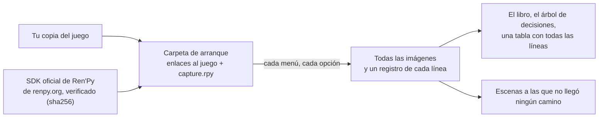

<div align="center">

# renpy-capture

**Cada línea de un juego de Ren'Py, en su escena y en todas sus ramas, sin tener que jugarlo.**

[](https://github.com/Aiken-Project-A/renpy-capture/actions/workflows/tests.yml)
[](../../LICENSE)


[English](../../README.md) · [Русский](ru.md) · [Українська](uk.md) · [简体中文](zh-CN.md) ·
[日本語](ja.md) · [한국어](ko.md) · **Español** · [Français](fr.md)

<sub>Esta es una traducción del [README en inglés](../../README.md); la guía y las páginas de referencia están en inglés.</sub>


<sub>Un momento de The Question, el juego de ejemplo que viene con Ren'Py, en inglés y en la traducción al ruso que trae
consigo: dos fotogramas dibujados por el propio motor del juego. Sus ilustraciones se publican bajo la licencia MIT.</sub>

### [Ver el ejemplo en vivo →](https://aiken-project-a.github.io/renpy-capture/)

</div>

renpy-capture ejecuta un juego de Ren'Py con su propio motor en una pantalla oculta, prueba todas las opciones de cada
menú y guarda la imagen que ve el jugador en cada línea. El resultado es un pequeño sitio web: puedes leerlo en el
navegador, buscar en él y enviárselo a quien quieras.

## Qué obtienes

<picture>
  <source media="(prefers-color-scheme: dark)" srcset="../images/book-dark.jpg">
  
</picture>

- **[El libro del juego.](https://aiken-project-a.github.io/renpy-capture/the-question/)** Cada línea junto a la imagen
  que ve el jugador, con quién la dice y dónde está en el guion. Puedes buscar en él y enlazar cualquier línea.
- **[El árbol de decisiones.](https://aiken-project-a.github.io/renpy-capture/the-question/choices.html)** Cada menú y
  cada opción, hasta el final de cada camino; cada opción te lleva a su momento en el libro.
- **[La traducción junto al original.](https://aiken-project-a.github.io/renpy-capture/the-question-ru/)** Para un
  juego que ya tiene traducción (`game/tl/<language>`): cada línea traducida tal como la dibuja el propio juego, en su
  propia ventana de diálogo, junto al original. ¿Cabe el texto? ¿Tiene la fuente todas las letras? renpy-capture
  muestra traducciones; no las hace.
- **Prueba de que no falta nada.** Al terminar, se lee el guion del juego y se indica cada escena a la que no llegó
  ningún camino, con su etiqueta, archivo y línea.

## Para quién es

| Para | Qué te da |
|---|---|
| **Traductores** | Cada línea con su contexto: quién habla, qué hay en pantalla, qué vino antes. |
| **Editores y correctores** | Toda la traducción tal como la muestra el juego, en un solo enlace: nada que instalar, ninguna ruta que volver a jugar. |
| **Autores y testers** | Todas las rutas en una sola pasada: detecta una línea que se sale de la ventana o una imagen que falta, encuentra las ramas a las que ningún jugador puede llegar, compara dos versiones línea por línea. |
| **Redactores de guías y wikis** | El árbol de decisiones con todos los finales y una imagen para cada paso. |
| **Estudiantes de idiomas** | Un juego que te encanta y su traducción como un libro bilingüe, línea por línea. |
| **Revisores y archivistas** | Todas las escenas de todas las ramas sin jugar: antes de una clasificación por edades, para investigar, para que un juego se pueda seguir leyendo. |

## Pruébalo

```sh
pipx install renpy-capture
renpy-capture capture ~/Games/SomeGame work/
xdg-open work/export/index.html
```

Un solo comando hace todo el trabajo: descarga el SDK oficial de Ren'Py de la misma versión que el juego, juega todas
las ramas en una pantalla oculta, busca escenas a las que no llegó ninguna rama y crea las páginas. Si se interrumpe,
vuelve a ejecutarlo y seguirá por donde iba. The Question tarda seis segundos; un juego comercial grande, de
22 000 líneas, unos ocho minutos.

Si el juego ya trae una traducción en `game/tl/russian`, captura el original y la traducción, ambos con la ventana de
diálogo del juego, y abre el libro de la traducción, donde el original aparece junto a cada línea.

```sh
renpy-capture capture ~/Games/SomeGame work/ --text
renpy-capture capture ~/Games/SomeGame work/ --text --language russian
xdg-open work/export-text-russian/index.html
```

> [!NOTE]
> Linux o Windows 10/11, con Python 3.9 o superior. En Linux, KWin o Xvfb para la pantalla oculta; en Windows el juego se ejecuta en un escritorio aparte y en la pantalla no aparece nada (en Windows, la página se abre con `start` en lugar de `xdg-open`). Más detalles en [la guía](https://github.com/Aiken-Project-A/renpy-capture/blob/main/docs/guide.md#on-windows).

## Por qué puedes confiar en las imágenes

- **Las dibuja el propio motor del juego.** El SDK oficial de Ren'Py, en la misma versión que usa el juego, lo ejecuta
  con sus fuentes, transiciones, imágenes por capas, animaciones y pantallas. No se reconstruye nada a partir del guion.
- **Todas las ramas y, después, una comprobación.** Se prueban todas las opciones de cada menú; luego se lee el guion y
  se indica cualquier escena a la que no haya llegado ningún camino.
- **La misma imagen, siempre.** El tiempo del juego se cuenta en fotogramas, no con el reloj; lo que depende del azar
  sale igual cada vez; una escena se guarda cuando ya está quieta. Si lo ejecutas dos veces, los archivos son
  idénticos, así que, si dos resultados difieren, la diferencia es real.
- **Tu copia queda intacta.** El juego se ejecuta desde una carpeta aparte que solo contiene enlaces a él; el SDK viene
  de renpy.org y se comprueba que es exactamente el oficial.

Probado con un juego comercial grande: 44 ramas y 21 945 líneas en unos ocho minutos, con cuatro copias del motor en
paralelo, y todas las imágenes idénticas, byte a byte, a las de la ejecución anterior.

## Comparado con lo que haces ahora

| | Jugarlo entero | Archivos y herramientas de traducción | renpy-capture |
|---|:---:|:---:|:---:|
| Cada línea en su escena | ✓ | — | ✓ |
| Todas las ramas y la prueba de que no falta ninguna | a mano, ruta por ruta | todos los textos, se lleguen a ver o no | ✓ |
| La traducción junto al original | volver a jugar en cada idioma | solo el texto | ✓ fotograma junto a fotograma, tal como lo dibuja el juego |
| Búsqueda, enlace a cualquier línea, una sola página para compartir | — | búsqueda | ✓ |
| Editar la traducción | — | ✓ | — |

renpy-capture no sustituye a tus herramientas de traducción: muestra lo que producen, dentro del juego.

## Conviene saber

- Responde a los menús, pero no juega a los minijuegos. Un mapa, un cuestionario o un desafío con límite de tiempo se
  pueden guiar desde la configuración del juego: consulta [la guía](../guide.md#games-that-need-help) (en inglés).
- El SDK oficial tiene que poder ejecutar el juego: un juego que se distribuye con un motor modificado puede que no
  arranque.

<details>
<summary><b>Cómo funciona</b></summary>



- Dentro del motor, un pequeño programa toma la imagen cuando la escena ya está quieta: las animaciones y las
  transiciones han terminado y ya nada pide volver a dibujarse. Una animación sin fin se captura siempre en el mismo
  punto.
- Una tarea avanza por el juego desde una etiqueta del guion y responde a los menús con las opciones que se le
  indicaron. Cada opción que aún no se ha elegido se convierte en una tarea nueva, hasta que no queda ninguna; varias
  copias del motor funcionan a la vez, y si una se bloquea, se reinicia automáticamente.
- Las modificaciones (mods) que dibujan encima del juego se dejan fuera de la carpeta de arranque, así que las imágenes
  son las del propio juego.

</details>

## Más información

- **[La guía](../guide.md)** (en inglés): instalación, la pantalla oculta, traducciones, todos los comandos, qué
  contiene cada archivo, juegos que necesitan ayuda, qué hacer cuando algo no va bien.
- [La configuración](../config.md) y [los archivos que genera](../output.md), campo por campo (en inglés) · [Historial de cambios](../../CHANGELOG.md) (en inglés)

## Respeta a los autores

Captura juegos que poseas. Las imágenes y los textos son obra de sus autores: no los publiques sin permiso.

## Licencia

MIT; consulta [LICENSE](../../LICENSE). Hecho por Aiken y Claude.
