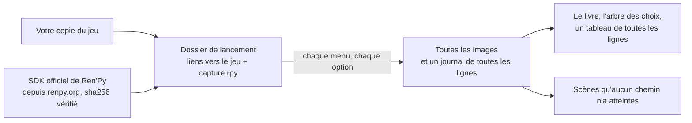

<div align="center">

# renpy-capture

**Chaque ligne d'un jeu Ren'Py, dans sa scène, sur toutes les branches — sans y jouer.**

[](https://github.com/Aiken-Project-A/renpy-capture/actions/workflows/tests.yml)
[](../../LICENSE)


[English](../../README.md) · [Русский](ru.md) · [Українська](uk.md) · [简体中文](zh-CN.md) ·
[日本語](ja.md) · [한국어](ko.md) · [Español](es.md) · **Français**

<sub>Cette page est une traduction du [README anglais](../../README.md) ; le guide et les pages de référence sont en anglais.</sub>


<sub>Un moment de The Question, le jeu d'exemple fourni avec Ren'Py, en anglais et dans la traduction russe qui
l'accompagne : deux images dessinées par le moteur du jeu lui-même. Les illustrations sont publiées sous licence MIT.</sub>

### [Voir l'exemple en ligne →](https://aiken-project-a.github.io/renpy-capture/)

</div>

renpy-capture fait tourner un jeu Ren'Py dans son propre moteur sur un écran caché, essaie toutes les options de chaque
menu de choix et enregistre, à chaque ligne, l'image que le joueur a sous les yeux. Il en sort un petit site web :
ouvrez-le dans un navigateur, faites-y des recherches, envoyez-le à qui vous voulez.

## Ce que vous obtenez

<picture>
  <source media="(prefers-color-scheme: dark)" srcset="../images/book-dark.jpg">
  
</picture>

- **[Le livre du jeu.](https://aiken-project-a.github.io/renpy-capture/the-question/)** Chaque ligne à côté de
  l'image que voit le joueur, avec le personnage qui parle et la ligne du script d'où elle vient. Cherchez-y ce qu'il
  vous faut ; chaque ligne a son propre lien.
- **[L'arbre des choix.](https://aiken-project-a.github.io/renpy-capture/the-question/choices.html)** Tous les menus
  et toutes les options, jusqu'à l'issue de chaque chemin ; chaque option ouvre le livre au moment correspondant.
- **[La traduction à côté de l'original.](https://aiken-project-a.github.io/renpy-capture/the-question-ru/)** Pour un
  jeu qui a déjà une traduction (`game/tl/<language>`) : chaque ligne traduite telle que le jeu lui-même l'affiche,
  dans sa propre fenêtre de dialogue, à côté de l'original. Le texte tient-il dans la fenêtre ? La police a-t-elle
  toutes les lettres ? renpy-capture montre les traductions ; il ne les fait pas.
- **La preuve que rien n'a été oublié.** Ensuite, les scripts du jeu sont lus, et chaque scène qu'aucun chemin
  n'a atteinte est signalée, avec son label, son fichier et sa ligne.

## Pour qui ?

| Vous êtes | Ce qu'il vous apporte |
|---|---|
| **Traducteurs** | Chaque ligne avec son contexte : qui parle, ce qu'il y a à l'écran, ce qui précède. |
| **Relecteurs et correcteurs** | Toute la traduction telle que le jeu l'affiche, en un seul lien : rien à installer, aucune partie à rejouer. |
| **Auteurs et testeurs** | Toutes les branches en un seul lancement : repérez une ligne qui déborde de la fenêtre ou une image manquante, trouvez les branches qu'aucun joueur ne peut atteindre, comparez deux versions ligne par ligne. |
| **Rédacteurs de guides et de wikis** | L'arbre des choix avec toutes les fins, et une image pour chaque étape. |
| **Apprenants en langues** | Un jeu que vous aimez et sa traduction en livre bilingue, ligne par ligne. |
| **Évaluateurs et archivistes** | Chaque scène de chaque branche, sans y jouer : avant une classification par âge, pour la recherche, pour qu'un jeu reste lisible. |

## Essayer

```sh
pipx install git+https://github.com/Aiken-Project-A/renpy-capture
renpy-capture capture ~/Games/SomeGame work/
xdg-open work/export/index.html
```

Une seule commande fait tout : elle récupère le SDK officiel de Ren'Py dans la version du jeu, parcourt toutes les
branches sur un écran caché, cherche les scènes qu'aucune branche n'a atteintes et génère les pages. Relancez-la pour
reprendre après une interruption. The Question prend six secondes ; un gros jeu commercial de 22 000 lignes, environ
huit minutes.

Si le jeu a déjà une traduction dans `game/tl/russian`, capturez l'original et la traduction, tous deux avec la
fenêtre de dialogue du jeu, puis ouvrez le livre de la traduction : l'original y figure à côté de chaque ligne.

```sh
renpy-capture capture ~/Games/SomeGame work/ --text
renpy-capture capture ~/Games/SomeGame work/ --text --language russian
xdg-open work/export-text-russian/index.html
```

> [!NOTE]
> Linux uniquement pour l'instant : Python 3.9 ou plus récent, et KWin ou Xvfb pour l'écran caché. La version Windows est en préparation.

## Pourquoi vous pouvez vous fier aux images

- **C'est le moteur du jeu lui-même qui les dessine.** Le SDK officiel de Ren'Py, dans la version du jeu, fait tourner
  le jeu avec ses polices, ses transitions, ses images à calques, ses animations et ses écrans. Rien n'est reconstitué
  à partir du script.
- **Toutes les branches, puis une vérification.** Toutes les options de chaque menu sont essayées ; ensuite, les
  scripts sont lus, et toute scène qu'aucun chemin n'a atteinte est signalée.
- **La même image, à chaque fois.** Le temps du jeu avance image par image, et non selon l'horloge ; les événements
  aléatoires tombent de la même façon à chaque fois ; une scène n'est enregistrée qu'une fois stabilisée. Lancez
  renpy-capture deux fois : les fichiers sont identiques ; si deux résultats diffèrent, la différence est donc réelle.
- **Votre copie reste intacte.** Le jeu tourne depuis un dossier à part, qui ne contient que des liens vers ses
  fichiers ; le SDK vient de renpy.org et est vérifié avec sa somme de contrôle officielle.

Testé sur un gros jeu commercial : 44 branches et 21 945 lignes en environ huit minutes avec quatre copies du moteur
en parallèle ; chaque image est identique, octet pour octet, à celle du lancement précédent.

## Par rapport à vos méthodes actuelles

| | Jouer au jeu | Fichiers et outils de traduction | renpy-capture |
|---|:---:|:---:|:---:|
| Chaque ligne dans sa scène | ✓ | — | ✓ |
| Toutes les branches et la preuve qu'aucune n'a été oubliée | à la main, branche par branche | toutes les chaînes, atteignables ou non | ✓ |
| La traduction à côté de l'original | rejouer dans chaque langue | texte seul | ✓ les deux images côte à côte, telles que le jeu les dessine |
| Recherche, lien vers n'importe quelle ligne, une seule page à partager | — | recherche | ✓ |
| Modifier la traduction | — | ✓ | — |

renpy-capture ne remplace pas vos outils de traduction : il montre ce qu'ils produisent, dans le jeu.

## Bon à savoir

- Il fait les choix dans les menus ; il ne joue pas aux mini-jeux. Une carte, un quiz ou une épreuve chronométrée
  peuvent être guidés par un fichier de configuration propre au jeu, voir [le guide](../guide.md#games-that-need-help)
  (en anglais).
- C'est le SDK officiel qui doit faire tourner le jeu : un jeu livré avec un moteur modifié peut ne pas démarrer.

<details>
<summary><b>Comment ça marche</b></summary>



- Dans le moteur, un petit script capture l'image une fois la scène stabilisée : les animations et les transitions
  sont terminées, et plus rien ne demande à être redessiné. Une animation sans fin est toujours capturée au même
  point de son cycle.
- Une tâche parcourt le jeu à partir d'un label et fait, dans les menus, les choix qu'on lui a indiqués. Chaque
  option pas encore choisie devient une nouvelle tâche, jusqu'à ce qu'il n'en reste aucune ; plusieurs copies du
  moteur tournent en parallèle, et celle qui se bloque est relancée automatiquement.
- Les mods qui dessinent par-dessus le jeu sont exclus du dossier de lancement : les images sont donc bien celles
  du jeu.

</details>

## En savoir plus

- **[Le guide](../guide.md)** (en anglais) : l'installation, l'écran caché, les traductions, toutes les commandes,
  ce que contient chaque fichier, les jeux qui ont besoin d'un coup de pouce, les cas où quelque chose ne va pas.
- [La configuration](../config.md) et [les fichiers de sortie](../output.md), champ par champ (en anglais) ·
  [Journal des modifications](../../CHANGELOG.md) (en anglais)

## Respectez les auteurs

Ne capturez que des jeux que vous possédez. Les images et les textes sont l'œuvre de leurs auteurs : ne les publiez
pas sans autorisation.

## Licence

MIT, voir [LICENSE](../../LICENSE). Réalisé par Aiken et Claude.
