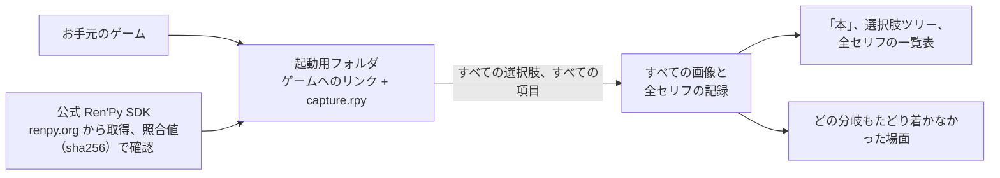

<div align="center">

# renpy-capture

**Ren'Py ゲームの全セリフを、その場面とともに、すべての分岐で。プレイせずに。**

[](https://github.com/Aiken-Project-A/renpy-capture/actions/workflows/tests.yml)
[](../../LICENSE)


[English](../../README.md) · [Русский](ru.md) · [Українська](uk.md) · [简体中文](zh-CN.md) ·
**日本語** · [한국어](ko.md) · [Español](es.md) · [Français](fr.md)

<sub>このページは[英語版 README](../../README.md) の翻訳です。ガイドとリファレンスのページは英語です。</sub>


<sub>Ren'Py に同梱されているサンプルゲーム The Question のワンシーンを、英語と、付属のロシア語訳で。2枚とも、ゲーム自身のエンジンが描いた画面です。このゲームの画像素材は MIT ライセンスで公開されています。</sub>

### [実際の出力例を見る →](https://aiken-project-a.github.io/renpy-capture/)

</div>

renpy-capture は、Ren'Py ゲームを見えない画面の上で、そのゲーム自身のエンジンのまま動かします。すべての選択肢を総当たりで選び、セリフごとに、プレイヤーが見る画面を保存します。できあがるのは小さなウェブサイトです。ブラウザで読めて、検索でき、誰にでも送れます。

## できあがるもの

<picture>
  <source media="(prefers-color-scheme: dark)" srcset="../images/book-dark.jpg">
  
</picture>

- **[ゲームの「本」](https://aiken-project-a.github.io/renpy-capture/the-question/)**：すべてのセリフを、プレイヤーが見る画面の横に、話し手とスクリプト上の位置を添えて並べます。検索でき、どのセリフにも直接リンクできます。
- **[選択肢ツリー](https://aiken-project-a.github.io/renpy-capture/the-question/choices.html)**：すべての選択肢とそのすべての項目を、それぞれの分岐の行き着く先まで。どの項目からも、「本」のその場面を開けます。
- **[原文と並べた翻訳](https://aiken-project-a.github.io/renpy-capture/the-question-ru/)**：翻訳がすでにあるゲーム（`game/tl/<language>`）なら、訳されたすべてのセリフを、ゲーム自身が描くとおりに、そのゲームのメッセージウィンドウで原文の横に並べます。文章はウィンドウに収まっているか、フォントにその文字はあるか。renpy-capture は翻訳を見せるもので、翻訳を作るものではありません。
- **取りこぼしがないことの証明**：記録が終わると、ゲームのスクリプトを読み、どの分岐もたどり着かなかった場面をすべて、スクリプト上の場所（ラベル名・ファイル名・行番号）とともに挙げます。

## こんな方に

| 対象 | 得られるもの |
|---|---|
| **翻訳者** | すべてのセリフを文脈つきで。誰が話しているか、画面に何が映っているか、その前に何があったか。 |
| **編集者・校正者** | ゲームが表示するとおりの翻訳全体を、リンクひとつで。インストールも、ルートを遊び直す必要もありません。 |
| **ゲーム制作者・テスター** | 一度の実行で全ルートを。ウィンドウからはみ出すセリフや抜けている画像に気づき、どのプレイヤーもたどり着けない分岐を見つけ、2つのバージョンを1行ずつ比べられます。 |
| **攻略サイト・Wiki の執筆者** | すべてのエンディングまで載った選択肢ツリーと、各ステップの画像。 |
| **語学学習者** | 好きなゲームとその翻訳を、1行ずつの対訳本として。 |
| **審査・記録保存の担当者** | プレイせずに、全分岐の全場面を。年齢制限の審査の前に、研究のために、ゲームを読める形で残すために。 |

## 試してみる

```sh
pipx install renpy-capture
renpy-capture capture ~/Games/SomeGame work/
xdg-open work/export/index.html
```

コマンドひとつで、すべて済みます。ゲームと同じバージョンの公式 Ren'Py SDK（Ren'Py 本体）をダウンロードし、見えない画面ですべての分岐をプレイし、どの分岐もたどり着かなかった場面を探して、ページを作ります。中断しても、もう一度実行すれば続きから再開します。The Question なら6秒、22,000行の大規模な商業ゲームなら約8分です。

ゲームに `game/tl/russian` の翻訳がすでに入っている場合は、原文と翻訳をどちらもゲームのメッセージウィンドウつきで記録し、翻訳の「本」を開きます。すべてのセリフの横に原文が並びます。

```sh
renpy-capture capture ~/Games/SomeGame work/ --text
renpy-capture capture ~/Games/SomeGame work/ --text --language russian
xdg-open work/export-text-russian/index.html
```

> [!NOTE]
> Linux または Windows 10/11 で動作し、Python 3.9 以降が必要です。Linux では見えない画面に KWin または Xvfb を使い、Windows ではゲームが専用のデスクトップで動くため、画面には何も表示されません（Windows では `xdg-open` の代わりに `start` でページを開きます）。詳しくは[ガイド](https://github.com/Aiken-Project-A/renpy-capture/blob/main/docs/guide.md#on-windows)をご覧ください。

## 画像を信頼できる理由

- **描くのはゲーム自身のエンジンです。** ゲームと同じバージョンの公式 Ren'Py SDK が、フォントも、場面転換の効果も、重ね合わせた画像も、アニメーションも、ゲーム内の画面も含めて、ゲームをそのまま動かします。スクリプトから作り直したものは何もありません。
- **全分岐、そして確認。** すべての選択肢を総当たりで選んだあと、スクリプトを読み、どの分岐もたどり着かなかった場面があれば挙げます。
- **毎回、同じ画像。** ゲーム内の時間は時計ではなく描いたコマの数で進み、ランダムな出来事もいつも同じ結果になります。場面は動きが落ち着いてから保存します。2回実行してもファイルはまったく同じなので、2回の結果に違いがあれば、それは本当の違いです。
- **お手元のゲームはそのまま。** ゲームは、元のファイルへのリンクだけを置いた別のフォルダから起動します。SDK は renpy.org から取得し、公式のチェックサム（照合用の値）と照らし合わせて確認します。

大規模な商業ゲームでテスト済みです。ゲームを4つ並行して動かし、44分岐・21,945行を約8分。すべての画像が、前回の実行とファイルの中身まで完全に同じでした。

## いまのやり方と比べると

| | 自分でプレイ | 翻訳ファイルとツール | renpy-capture |
|---|:---:|:---:|:---:|
| 各セリフをその場面とともに | ✓ | — | ✓ |
| 全分岐と、取りこぼしがないことの証明 | 手作業で、1ルートずつ | 到達できるかどうかに関係なく、すべてのテキスト | ✓ |
| 原文と並べた翻訳 | 言語ごとにプレイし直し | テキストのみ | ✓ ゲームが描くとおりの画面を横に並べて |
| 検索、各セリフへのリンク、共有できる1ページ | — | 検索 | ✓ |
| 翻訳の編集 | — | ✓ | — |

renpy-capture は、お使いの翻訳ツールの代わりにはなりません。ツールで作ったものを、ゲームの中で見せるものです。

## 知っておきたいこと

- 選択肢には答えますが、ミニゲームはプレイしません。マップやクイズ、制限時間のある課題は、そのゲーム用の設定ファイルで進め方を指定できます。[ガイド](../guide.md#games-that-need-help)（英語）を参照してください。
- ゲームは公式 SDK で動かす必要があります。エンジンを改造して配布されているゲームは、起動しないことがあります。

<details>
<summary><b>仕組み</b></summary>



- エンジンの中では小さなスクリプトが、場面が落ち着いた時点で画像を撮ります。アニメーションも場面転換も終わり、画面を描き直す必要のあるものが何もなくなった時点です。終わりのないアニメーションは、毎回同じ瞬間を撮ります。
- 1回のプレイは、スクリプトの決まった地点から始まり、指定された項目で選択肢に答えていきます。まだ選ばれていない項目は、それぞれが新しいプレイになり、残りがなくなるまで続きます。ゲームを複数並行して動かし、止まってしまったものは自動で再起動します。
- ゲームの画面に重ねて描く MOD（後から追加する改造ファイル）は起動用フォルダに入れないので、画像はゲーム本来のものだけです。

</details>

## さらに詳しく

- **[ガイド](../guide.md)**（英語）：インストール、見えない画面、翻訳、すべてのコマンド、各ファイルの中身、手助けが必要なゲーム、うまくいかないとき。
- [設定ファイル](../config.md)と[出力ファイル](../output.md)の項目ごとの説明（英語） · [変更履歴](../../CHANGELOG.md)（英語）

## 作者に敬意を

記録するのは、ご自身が持っているゲームだけにしてください。画像も文章も作者の作品です。許可なく公開しないでください。

## ライセンス

MIT ライセンスです。[LICENSE](../../LICENSE) をご覧ください。Aiken と Claude が作りました。
