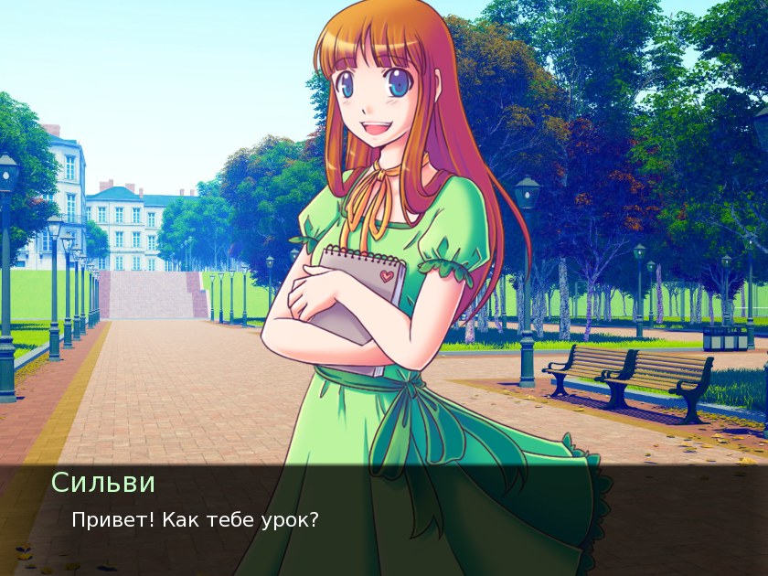
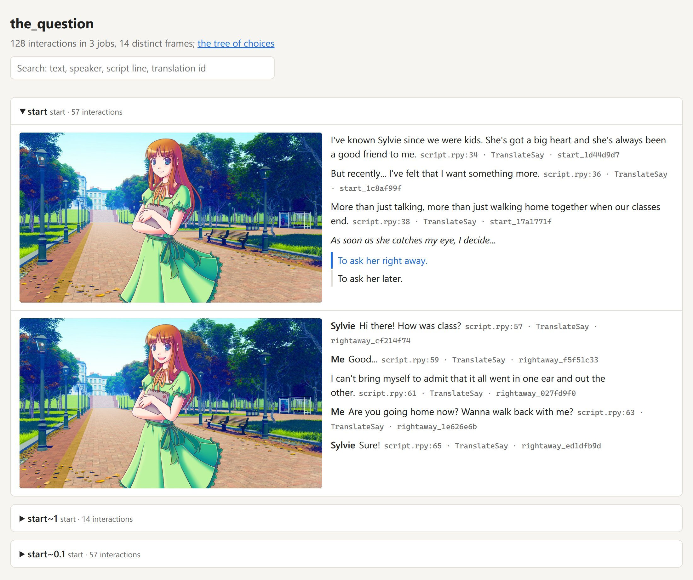
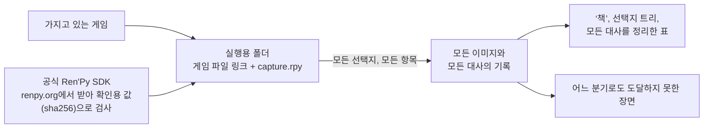

<div align="center">

# renpy-capture

**Ren'Py 게임의 모든 대사를 장면 속 그대로, 모든 분기에서 — 직접 플레이하지 않고도.**

[](https://github.com/Aiken-Project-A/renpy-capture/actions/workflows/tests.yml)
[](../../LICENSE)


[English](../../README.md) · [Русский](ru.md) · [Українська](uk.md) · [简体中文](zh-CN.md) ·
[日本語](ja.md) · **한국어** · [Español](es.md) · [Français](fr.md)

<sub>이 문서는 [영문 README](../../README.md)를 번역한 것입니다. 가이드와 참고 문서는 영어로 되어 있습니다.</sub>




<sub>Ren'Py와 함께 배포되는 예제 게임 The Question의 한 장면을, 영어 원문과 게임에 포함된 러시아어 번역으로 보여 줍니다. 두 장 모두 게임의 엔진이 직접 그린 화면입니다. 이 게임의 그림은 MIT 라이선스로 공개되어 있습니다.</sub>

### [실제 예시 보기 →](https://aiken-project-a.github.io/renpy-capture/)

</div>

renpy-capture는 Ren'Py 게임을 보이지 않는 화면에서 그 게임의 엔진으로 직접 실행합니다. 모든 선택지에서 모든 항목을 하나씩 골라 보고, 대사마다 플레이어가 보는 화면을 이미지로 저장합니다. 결과물은 작은 웹사이트입니다. 브라우저로 읽고, 검색하고, 누구에게나 보낼 수 있습니다.

## 결과물

<picture>
  <source media="(prefers-color-scheme: dark)" srcset="../images/book-dark.jpg">
  
</picture>

- **[게임의 ‘책’](https://aiken-project-a.github.io/renpy-capture/the-question/)**: 플레이어가 보는 화면 옆에 모든 대사를 보여 줍니다. 말하는 인물과 스크립트의 몇 번째 줄인지도 함께 나옵니다. 검색할 수 있고, 어느 대사에든 링크를 걸 수 있습니다.
- **[선택지 트리](https://aiken-project-a.github.io/renpy-capture/the-question/choices.html)**: 모든 선택지와 모든 항목을, 분기마다 어떻게 끝나는지까지 보여 줍니다. 항목을 누르면 ‘책’에서 그 장면이 열립니다.
- **[원문과 나란히 놓인 번역](https://aiken-project-a.github.io/renpy-capture/the-question-ru/)**: 이미 번역이 들어 있는 게임(`game/tl/<language>`)이라면, 번역된 모든 대사를 게임이 직접 그리는 그대로, 그 게임 고유의 대화창에 담아 원문 옆에 보여 줍니다. 글이 대화창에 다 들어가는지, 글꼴에 그 글자가 있는지 확인할 수 있습니다. renpy-capture는 번역을 보여 줄 뿐, 번역해 주지는 않습니다.
- **빠뜨린 것이 없다는 증명**: 실행이 끝나면 게임의 스크립트를 읽고, 어느 분기로도 도달하지 못한 장면을 하나하나 스크립트 속 위치(레이블, 파일, 줄 번호)와 함께 알려 줍니다.

## 이런 분들께

| 대상 | 얻을 수 있는 것 |
|---|---|
| **번역자** | 모든 대사를 맥락과 함께: 누가 말하는지, 화면에 무엇이 있는지, 그 전에 무슨 일이 있었는지. |
| **편집자와 교정자** | 게임에 나오는 그대로의 번역 전체를 링크 하나로. 설치할 것도 없고, 루트를 다시 플레이할 필요도 없습니다. |
| **게임 제작자와 테스터** | 한 번의 실행으로 모든 루트를. 대화창 밖으로 넘치는 대사나 빠진 이미지를 발견하고, 어떤 플레이어도 갈 수 없는 분기를 찾아내고, 두 버전을 한 줄씩 비교할 수 있습니다. |
| **공략·위키 작성자** | 모든 엔딩까지 담긴 선택지 트리와, 단계마다 이미지 한 장. |
| **외국어 학습자** | 좋아하는 게임과 그 번역을, 한 줄씩 두 언어로 나란히 읽는 책으로. |
| **검토자와 기록 보존 담당자** | 플레이하지 않고도 모든 분기의 모든 장면을. 연령 등급 심의를 앞두고, 연구를 위해, 게임을 읽을 수 있는 형태로 남기기 위해. |

## 사용해 보기

```sh
pipx install renpy-capture
renpy-capture capture ~/Games/SomeGame work/
xdg-open work/export/index.html
```

명령 하나로 모든 작업이 끝납니다. 게임과 같은 버전의 공식 Ren'Py SDK(Ren'Py 본체)를 내려받고, 보이지 않는 화면에서 모든 분기를 플레이하고, 어느 분기로도 도달하지 못한 장면을 찾아본 뒤, 페이지를 만듭니다. 중간에 끊겨도 다시 실행하면 이어서 진행합니다. The Question은 6초, 22,000줄 분량의 대형 상용 게임은 약 8분이 걸립니다.

게임에 `game/tl/russian` 번역이 이미 들어 있다면, 원문과 번역을 각각 게임의 대화창이 함께 찍히도록 실행한 뒤 번역의 ‘책’을 엽니다. 모든 대사 옆에 원문이 나란히 놓여 있습니다.

```sh
renpy-capture capture ~/Games/SomeGame work/ --text
renpy-capture capture ~/Games/SomeGame work/ --text --language russian
xdg-open work/export-text-russian/index.html
```

> [!NOTE]
> 지금은 Linux에서만 쓸 수 있습니다. Python 3.9 이상, 그리고 보이지 않는 화면을 만들 KWin 또는 Xvfb가 필요합니다. Windows 지원도 준비 중입니다.

## 이미지를 믿을 수 있는 이유

- **게임의 엔진이 직접 그립니다.** 게임과 같은 버전의 공식 Ren'Py SDK가 게임을 실행합니다. 글꼴, 장면 전환 효과, 여러 장을 겹쳐 만든 이미지, 애니메이션, 게임 속 각종 화면까지 모두 게임 그대로입니다. 스크립트를 바탕으로 다시 만든 것은 하나도 없습니다.
- **모든 분기를 거친 뒤, 확인까지 합니다.** 모든 선택지에서 모든 항목을 골라 본 다음, 스크립트를 읽어 어느 분기로도 도달하지 못한 장면이 있으면 알려 줍니다.
- **언제나 같은 이미지가 나옵니다.** 게임 속 시간은 실제 시계가 아니라 화면을 그린 횟수에 맞춰 흐르고, 무작위로 정해지는 일도 매번 같은 결과가 나옵니다. 장면은 움직임이 다 멈춘 뒤에 저장합니다. 두 번 실행하면 파일이 완전히 똑같이 나오므로, 두 실행 결과에 차이가 있다면 그것은 진짜 차이입니다.
- **가지고 있는 게임은 그대로 둡니다.** 게임은 원래 파일을 가리키는 링크만 담긴 별도의 폴더에서 실행됩니다. SDK는 renpy.org에서 받아 공식 체크섬(확인용 값)과 맞는지 검사합니다.

대형 상용 게임으로 테스트했습니다. 엔진 4개를 동시에 돌려 44개 분기, 21,945줄을 약 8분 만에 마쳤고, 모든 이미지가 직전 실행 결과와 파일 내용까지 완전히 같았습니다.

## 지금 쓰는 방법과 비교하면

| | 직접 플레이 | 번역 파일과 도구 | renpy-capture |
|---|:---:|:---:|:---:|
| 각 대사를 장면 속에서 | ✓ | — | ✓ |
| 모든 분기, 그리고 빠뜨린 것이 없다는 증명 | 수작업으로 한 루트씩 | 도달할 수 있든 없든 모든 텍스트 | ✓ |
| 원문과 나란히 놓인 번역 | 언어마다 다시 플레이 | 텍스트만 | ✓ 게임이 그리는 그대로의 화면을 나란히 |
| 검색, 어느 대사로든 가는 링크, 공유할 페이지 하나 | — | 검색 | ✓ |
| 번역 수정 | — | ✓ | — |

renpy-capture는 지금 쓰는 번역 도구를 대신하지 않습니다. 그 도구로 만든 결과물을 게임 속에서 보여 줍니다.

## 알아 두면 좋은 점

- 선택지는 고르지만, 미니게임은 플레이하지 않습니다. 지도 화면, 퀴즈, 제한 시간이 있는 과제는 그 게임의 설정 파일로 진행 방법을 정해 줄 수 있습니다. [가이드](../guide.md#games-that-need-help)(영문)를 참고하세요.
- 공식 SDK로 게임을 실행할 수 있어야 합니다. 엔진을 수정해서 배포된 게임은 실행되지 않을 수 있습니다.

<details>
<summary><b>작동 방식</b></summary>



- 엔진 안에서는 작은 스크립트가, 장면의 움직임이 다 멈춘 뒤에 이미지를 찍습니다. 애니메이션과 장면 전환이 끝나고, 더 이상 화면을 다시 그릴 일이 없을 때입니다. 끝없이 반복되는 애니메이션은 매번 같은 순간에 찍습니다.
- 작업 하나는 스크립트의 한 지점(레이블)에서부터 게임을 플레이하며, 주어진 항목대로 선택지를 고릅니다. 아직 고르지 않은 항목은 하나하나가 새 작업이 되고, 남은 항목이 없을 때까지 계속됩니다. 엔진 여러 개가 동시에 돌아가며, 멈춰 버린 엔진은 자동으로 다시 시작됩니다.
- 게임 화면 위에 덧그리는 모드(따로 추가하는 개조 파일)는 실행용 폴더에 넣지 않으므로, 이미지는 온전히 게임 본래의 것입니다.

</details>

## 더 알아보기

- **[가이드](../guide.md)**(영문): 설치, 보이지 않는 화면, 번역, 모든 명령어, 각 파일에 담긴 내용, 추가 설정이 필요한 게임, 문제가 생겼을 때.
- [설정 파일](../config.md)과 [출력 파일](../output.md)의 항목별 설명(영문) · [변경 기록](../../CHANGELOG.md)(영문)

## 원작자를 존중해 주세요

가지고 있는 게임에만 사용하세요. 그림과 글은 원작자의 작품이니, 허락 없이 공개하지 마세요.

## 라이선스

MIT 라이선스입니다. [LICENSE](../../LICENSE)를 참고하세요. Aiken과 Claude가 만들었습니다.
