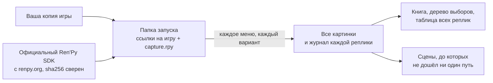

<div align="center">

# renpy-capture

**Каждая реплика игры на Ren'Py — в своей сцене, во всех ветках, без прохождения.**

[](https://github.com/Aiken-Project-A/renpy-capture/actions/workflows/tests.yml)
[](../../LICENSE)


[English](../../README.md) · **Русский** · [Українська](uk.md) · [简体中文](zh-CN.md) ·
[日本語](ja.md) · [한국어](ko.md) · [Español](es.md) · [Français](fr.md)

<sub>Это перевод [английского README](../../README.md); руководство и справочные страницы — на английском.</sub>


<sub>Один миг The Question, демонстрационной игры, которая идёт вместе с Ren'Py, — по-английски и в русском переводе,
который к ней прилагается: два кадра, нарисованные движком самой игры. Графика опубликована под лицензией MIT.</sub>

### [Посмотреть живой пример →](https://aiken-project-a.github.io/renpy-capture/)

</div>

renpy-capture запускает игру на Ren'Py её собственным движком на скрытом экране, в каждом меню выбирает по очереди все
варианты и сохраняет картинку, которую игрок видит на каждой реплике. На выходе — небольшой сайт: его можно читать в
браузере, искать по нему и отправить кому угодно.

## Что вы получаете

<picture>
  <source media="(prefers-color-scheme: dark)" srcset="../images/book-dark.jpg">
  
</picture>

- **[Книга игры.](https://aiken-project-a.github.io/renpy-capture/the-question/)** Каждая реплика рядом с картинкой,
  которую видит игрок, — с именем говорящего и строкой сценария. Поиск по всему тексту, ссылка на любую реплику.
- **[Дерево выборов.](https://aiken-project-a.github.io/renpy-capture/the-question/choices.html)** Каждое меню и
  каждый вариант — вплоть до того, чем кончается каждый путь; каждый вариант открывает своё место в книге.
- **[Перевод рядом с оригиналом.](https://aiken-project-a.github.io/renpy-capture/the-question-ru/)** Для игры, в
  которой перевод уже есть (`game/tl/<language>`): каждая переведённая реплика — такая, какой её рисует сама игра, в
  её собственном окне диалога, рядом с оригиналом. Влезает ли текст, есть ли в шрифте нужные буквы. renpy-capture
  показывает переводы, но не делает их.
- **Доказательство, что ничего не пропущено.** Когда все ветки пройдены, программа читает сценарии игры и называет
  каждую сцену, до которой не дошёл ни один путь, — с меткой, файлом и строкой.

## Кому это нужно

| Кто вы | Что это даёт |
|---|---|
| **Переводчики** | Каждая строка в контексте: кто говорит, что на экране, что было перед этим. |
| **Редакторы и корректоры** | Весь перевод таким, каким его показывает игра, по одной ссылке: ничего не нужно устанавливать и заново проходить игру. |
| **Авторы и тестировщики** | Все ветки за один запуск: увидеть реплику, вылезшую за окно, или пропавшую картинку, найти ветки, до которых не дойдёт ни один игрок, сравнить две сборки строка за строкой. |
| **Авторы гайдов и вики** | Дерево выборов со всеми концовками и картинка на каждый шаг. |
| **Изучающие язык** | Любимая игра и её перевод — двуязычная книга, строка за строкой. |
| **Проверка содержимого и архивы** | Каждая сцена каждой ветки без прохождения: перед возрастным рейтингом, для исследования, чтобы игру можно было прочесть и через годы. |

## Попробовать

```sh
pipx install renpy-capture
renpy-capture capture ~/Games/SomeGame work/
xdg-open work/export/index.html
```

Одна команда делает всё: скачивает официальный Ren'Py SDK той версии, на которой сделана игра, проходит все ветки на
скрытом экране, ищет сцены, до которых не дошла ни одна ветка, и собирает страницы. Если работа прервалась, запустите
команду снова — она продолжит с того же места. The Question проходится за шесть секунд, большая коммерческая игра на
22 000 строк — примерно за восемь минут.

Если в игре уже есть перевод (`game/tl/russian`), запустите программу дважды — для оригинала и для перевода, оба раза с
окном диалога игры — и откройте книгу перевода: в ней рядом с каждой репликой стоит оригинал.

```sh
renpy-capture capture ~/Games/SomeGame work/ --text
renpy-capture capture ~/Games/SomeGame work/ --text --language russian
xdg-open work/export-text-russian/index.html
```

> [!NOTE]
> Linux или Windows 10/11, Python 3.9 или новее. На Linux скрытый экран дают KWin или Xvfb; на Windows игра идёт на отдельном рабочем столе, и на экране ничего не появляется (страница на Windows открывается командой `start` вместо `xdg-open`). Подробнее — в [руководстве](https://github.com/Aiken-Project-A/renpy-capture/blob/main/docs/guide.md#on-windows).

## Почему картинкам можно верить

- **Их рисует движок самой игры.** Игру запускает официальный Ren'Py SDK её версии — с её шрифтами, переходами,
  многослойными изображениями, анимациями и экранами. Ничего не воссоздаётся по сценарию.
- **Все ветки, потом проверка.** В каждом меню программа выбирает по очереди все варианты, потом читает сценарии и
  называет каждую сцену, до которой не дошёл ни один путь.
- **Одна и та же картинка, каждый раз.** Время в игре отсчитывается по кадрам, а не по настоящим часам; случайные
  события каждый раз выпадают одинаково; кадр сохраняется, когда сцена успокоилась. Запустите дважды — файлы совпадут,
  поэтому разница между двумя запусками всегда настоящая.
- **Ваша копия остаётся нетронутой.** Игра запускается из отдельной папки, которая только ссылается на её файлы; SDK
  берётся с renpy.org и сверяется с официальной контрольной суммой.

Проверено на большой коммерческой игре: 44 ветки и 21 945 строк примерно за восемь минут в четыре потока, и каждая
картинка совпала с предыдущим запуском байт в байт.

## Сравнение с тем, как это делают сейчас

| | Прохождение вручную | Файлы и программы перевода | renpy-capture |
|---|:---:|:---:|:---:|
| Каждая реплика в своей сцене | ✓ | — | ✓ |
| Все ветки и доказательство, что ничего не пропущено | вручную, ветку за веткой | все строки подряд, достижимые или нет | ✓ |
| Перевод рядом с оригиналом | пройти заново на каждом языке | только текст | ✓ кадр рядом с кадром, как рисует игра |
| Поиск, ссылка на любую реплику, одна страница, чтобы поделиться | — | поиск | ✓ |
| Правка перевода | — | ✓ | — |

renpy-capture не заменяет ваши программы перевода: он показывает, что у них получилось, в самой игре.

## Полезно знать

- Программа выбирает варианты в меню, но не играет в мини-игры. Карту, викторину или испытание на время можно пройти
  с помощью настроек в конфиге — см. [руководство](../guide.md#games-that-need-help) (на английском).
- Игру должен запускать официальный SDK: игра с изменённым движком может не запуститься.

<details>
<summary><b>Как это устроено</b></summary>



- Внутри движка работает небольшой скрипт: он сохраняет кадр, когда сцена успокоилась — анимации и переходы
  закончились, и ничто больше не просит перерисовки. Бесконечная анимация всегда сохраняется в одной и той же фазе.
- Каждое задание проходит игру с заданной метки и выбирает в меню назначенные ему варианты. Каждый ещё не выбранный
  вариант становится новым заданием, пока варианты не кончатся; несколько копий движка работают одновременно, а
  зависшая перезапускается сама.
- Моды, которые рисуют поверх игры, в папку запуска не попадают, поэтому на картинках — только сама игра.

</details>

## Дальше

- **[Руководство](../guide.md)** (на английском): установка, скрытый экран, переводы, все команды, что лежит в каждом
  файле, игры, которым нужна помощь, что делать, если что-то не так.
- [Конфиг](../config.md) и [выходные файлы](../output.md), поле за полем · [Список изменений](../../CHANGELOG.md) —
  всё на английском.

## Уважайте авторов

Используйте программу только с играми, которые у вас есть. Картинки и слова — труд их авторов: не публикуйте их без
разрешения.

## Лицензия

MIT, см. [LICENSE](../../LICENSE). Сделали Aiken и Claude.
