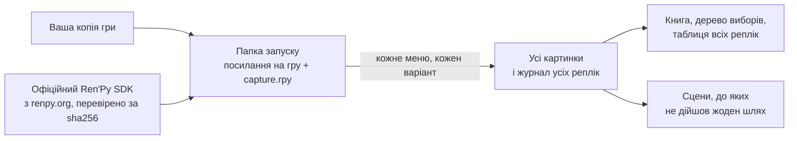

<div align="center">

# renpy-capture

**Кожна репліка гри на Ren'Py — у своїй сцені, в усіх гілках, без проходження.**

[](https://github.com/Aiken-Project-A/renpy-capture/actions/workflows/tests.yml)
[](../../LICENSE)


[English](../../README.md) · [Русский](ru.md) · **Українська** · [简体中文](zh-CN.md) ·
[日本語](ja.md) · [한국어](ko.md) · [Español](es.md) · [Français](fr.md)

<sub>Це переклад [англійського README](../../README.md); посібник і довідкові сторінки — англійською.</sub>


<sub>Одна мить із The Question, демонстраційної гри, що входить до складу Ren'Py, — англійською та в російському
перекладі, який до неї додається: два кадри, намальовані рушієм самої гри. Її графіка поширюється за ліцензією MIT.</sub>

### [Подивитися приклад наживо →](https://aiken-project-a.github.io/renpy-capture/)

</div>

renpy-capture запускає гру на Ren'Py у її власному рушії на прихованому екрані, у кожному меню вибору по черзі обирає
всі варіанти й зберігає картинку, яку гравець бачить на кожній репліці. На виході — невеликий сайт: його можна читати
в браузері, шукати в ньому й надіслати будь-кому.

## Що ви отримаєте

<picture>
  <source media="(prefers-color-scheme: dark)" srcset="../images/book-dark.jpg">
  
</picture>

- **[Книга гри.](https://aiken-project-a.github.io/renpy-capture/the-question/)** Кожна репліка поруч із картинкою,
  яку бачить гравець, — з ім'ям того, хто говорить, і рядком сценарію. Пошук у книзі й посилання на будь-яку репліку.
- **[Дерево виборів.](https://aiken-project-a.github.io/renpy-capture/the-question/choices.html)** Кожне меню й кожен
  варіант — аж до того, чим закінчується кожен шлях; кожен варіант відкриває своє місце в книзі.
- **[Переклад поруч з оригіналом.](https://aiken-project-a.github.io/renpy-capture/the-question-ru/)** Для гри, у якій
  уже є переклад (`game/tl/<language>`): кожна перекладена репліка поруч з оригіналом — така, як її малює сама гра у
  своєму вікні діалогу. Видно, чи вміщується текст і чи є в шрифті потрібні літери. renpy-capture показує переклади,
  але сам їх не робить.
- **Доказ того, що нічого не пропущено.** Коли всі гілки пройдено, програма читає сценарії гри й називає кожну сцену,
  до якої не дійшов жоден шлях, — з міткою, файлом і рядком.

## Для кого це

| Хто ви | Що це вам дає |
|---|---|
| **Перекладачі** | Кожна репліка в контексті: хто говорить, що на екрані, що було перед цим. |
| **Редактори й коректори** | Увесь переклад, як його показує гра, — за одним посиланням: нічого не треба встановлювати й не треба заново проходити гру. |
| **Автори й тестувальники** | Усі гілки за один запуск: побачити репліку, що не вміщується у вікно, чи картинку, якої бракує; знайти гілки, до яких не може дійти жоден гравець; порівняти дві версії гри рядок за рядком. |
| **Автори путівників і вікі** | Дерево виборів з усіма кінцівками й картинка до кожного кроку. |
| **Ті, хто вивчає мови** | Улюблена гра та її переклад як двомовна книга, рядок за рядком. |
| **Рецензенти й архівісти** | Кожна сцена кожної гілки без проходження: перед визначенням вікового рейтингу, для досліджень, щоб гру й надалі можна було прочитати. |

## Спробуйте

```sh
pipx install git+https://github.com/Aiken-Project-A/renpy-capture
renpy-capture capture ~/Games/SomeGame work/
xdg-open work/export/index.html
```

Одна команда робить усе: завантажує офіційний Ren'Py SDK тієї версії, на якій зроблено гру, проходить усі гілки на
прихованому екрані, шукає сцени, до яких не дійшла жодна гілка, і створює сторінки. Якщо роботу перервано, запустіть
команду ще раз — і вона продовжиться. The Question проходиться за шість секунд, велика комерційна гра на 22 000 рядків —
приблизно за вісім хвилин.

Якщо в грі вже є переклад у `game/tl/russian`, запустіть програму для оригіналу й для перекладу — обидва рази з вікном
діалогу гри — і відкрийте книгу перекладу: у ній поруч із кожною реплікою стоїть оригінал.

```sh
renpy-capture capture ~/Games/SomeGame work/ --text
renpy-capture capture ~/Games/SomeGame work/ --text --language russian
xdg-open work/export-text-russian/index.html
```

> [!NOTE]
> Поки що лише Linux: Python 3.9 або новіший і KWin чи Xvfb для прихованого екрана. Підтримка Windows — на підході.

## Чому картинкам можна довіряти

- **Їх малює рушій самої гри.** Гру запускає офіційний Ren'Py SDK тієї самої версії — з її шрифтами, переходами,
  багатошаровими зображеннями, анімаціями й екранами. Нічого не реконструюється зі сценарію.
- **Усі гілки, а потім перевірка.** У кожному меню програма по черзі обирає всі варіанти, потім читає сценарії й
  називає кожну сцену, до якої не дійшов жоден шлях.
- **Щоразу та сама картинка.** Час у грі відлічується за кадрами, а не за годинником; випадкові події щоразу
  відбуваються однаково; картинка зберігається, щойно сцена завмерла. Запустіть двічі — і файли будуть однакові, тож
  будь-яка різниця між двома запусками справжня.
- **Ваша копія залишається без змін.** Гра запускається з окремої папки, де є лише посилання на її файли; SDK
  завантажується з renpy.org і звіряється з офіційною контрольною сумою.

Перевірено на великій комерційній грі: 44 гілки й 21 945 рядків приблизно за вісім хвилин у чотири потоки, і кожна
картинка байт у байт така сама, як у попередньому запуску.

## Порівняно з тим, що ви робите зараз

| | Проходження гри | Файли й програми для перекладу | renpy-capture |
|---|:---:|:---:|:---:|
| Кожна репліка у своїй сцені | ✓ | — | ✓ |
| Усі гілки й доказ того, що жодної не пропущено | вручну, гілка за гілкою | кожен рядок, досяжний чи ні | ✓ |
| Переклад поруч з оригіналом | пройти заново кожною мовою | лише текст | ✓ кадр поруч із кадром, як їх малює гра |
| Пошук, посилання на будь-яку репліку, одна сторінка, якою можна поділитися | — | пошук | ✓ |
| Редагування перекладу | — | ✓ | — |

renpy-capture не замінює ваші програми для перекладу, а показує в самій грі, що в них виходить.

## Варто знати

- Програма обирає варіанти в меню, але не грає в міні-ігри. Як пройти карту, вікторину чи завдання на час, їй можна
  підказати у файлі налаштувань для гри — див. [посібник](../guide.md#games-that-need-help) (англійською).
- Гру має запускати офіційний SDK: гра, випущена зі зміненим рушієм, може не запуститися.

<details>
<summary><b>Як це працює</b></summary>



- Усередині рушія невеликий скрипт зберігає картинку, щойно сцена завмерла: анімації й переходи закінчилися, і ніщо
  більше не просить перемалювати екран. Нескінченна анімація завжди зберігається в одній і тій самій фазі.
- Кожне завдання проходить гру з певної мітки й обирає в меню ті варіанти, які йому задано. Кожен варіант, якого ще не
  обирали, стає новим завданням, доки таких не залишиться; кілька копій рушія працюють одночасно, а та, що зависла,
  автоматично перезапускається.
- Модифікації, які малюють поверх гри, не потрапляють до папки запуску, тож на картинках — лише сама гра.

</details>

## Докладніше

- **[Посібник](../guide.md)** (англійською): встановлення, прихований екран, переклади, усі команди, що містить кожен
  файл, ігри, яким потрібна допомога, що робити, коли щось не так.
- [Файл налаштувань](../config.md) і [файли результату](../output.md), поле за полем (англійською) ·
  [Журнал змін](../../CHANGELOG.md) (англійською)

## Шануйте авторів

Використовуйте renpy-capture лише з іграми, які вам належать. Картинки й тексти — праця їхніх авторів: не публікуйте їх
без дозволу.

## Ліцензія

MIT, див. [LICENSE](../../LICENSE). Зробили Aiken і Claude.
