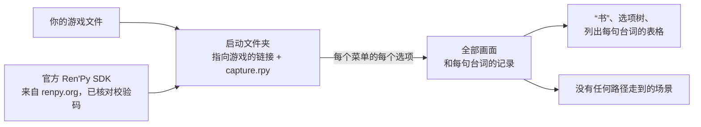

<div align="center">

# renpy-capture

**Ren'Py 游戏每一条分支里的每一句台词，都配上它所在的场景——无需亲自游玩。**

[](https://github.com/Aiken-Project-A/renpy-capture/actions/workflows/tests.yml)
[](../../LICENSE)


[English](../../README.md) · [Русский](ru.md) · [Українська](uk.md) · **简体中文** ·
[日本語](ja.md) · [한국어](ko.md) · [Español](es.md) · [Français](fr.md)

<sub>本页译自[英文 README](../../README.md)；使用指南和参考文档均为英文。</sub>


<sub>Ren'Py 自带的示例游戏 The Question 中的一幕，分别是英文原版和游戏自带的俄语译本：两幅画面都由游戏自己的引擎绘制。美术素材以 MIT 许可证发布。</sub>

### [查看在线示例 →](https://aiken-project-a.github.io/renpy-capture/)

</div>

renpy-capture 在一块隐藏的屏幕上，用游戏自己的引擎运行 Ren'Py 游戏，把每个选项菜单的每种选法都走一遍，并在每一句台词处保存玩家看到的画面。最后得到的是一个小网站：可以在浏览器里阅读、搜索，也可以发给任何人。

## 你会得到什么

<picture>
  <source media="(prefers-color-scheme: dark)" srcset="../images/book-dark.jpg">
  
</picture>

- **[整部游戏的“书”。](https://aiken-project-a.github.io/renpy-capture/the-question/)** 每一句台词旁都配有玩家看到的画面，并标出说话人和脚本中的对应行。可以搜索，也可以链接到任意一句。
- **[选项树。](https://aiken-project-a.github.io/renpy-capture/the-question/choices.html)** 每个选项菜单和每个选项，一直到每条路径的结局；点开任一选项，就会跳到它在“书”中对应的那一刻。
- **[译文与原文并排。](https://aiken-project-a.github.io/renpy-capture/the-question-ru/)** 适用于已经有翻译（`game/tl/<language>`）的游戏：每一句译文都按游戏自己绘制的样子，显示在游戏原本的对话框里，与原文并排。文字会不会超出对话框、字体有没有缺字，一看便知。renpy-capture 只展示翻译，不做翻译。
- **证明没有遗漏。** 运行结束后会读取游戏脚本，逐一列出没有任何路径走到的场景，并注明它所在的脚本段落（label）、文件和行号。

## 适合谁用

| 你是 | 你能得到 |
|---|---|
| **译者** | 每一句台词及其上下文：谁在说话、画面上有什么、之前发生了什么。 |
| **编辑和校对** | 整份译文在游戏中呈现的样子，一个链接就能看到：无需安装任何东西，也不用重打各条路线。 |
| **作者和测试人员** | 一次运行覆盖所有路线：发现超出对话框的台词或缺失的图片，找出任何玩家都走不到的分支，逐句对比两个版本。 |
| **攻略和 Wiki 编写者** | 包含每个结局的选项树，每一步都配有画面。 |
| **语言学习者** | 你喜欢的游戏和它的译文，变成一本逐句对照的双语读本。 |
| **审核人员和档案工作者** | 无需游玩即可看到每条分支的每个场景：可用于年龄分级前的审阅、研究，或让游戏始终保持可读。 |

## 试一试

```sh
pipx install renpy-capture
renpy-capture capture ~/Games/SomeGame work/
xdg-open work/export/index.html
```

一条命令完成全部工作：下载与游戏版本对应的 Ren'Py 官方引擎包（SDK），在隐藏屏幕上跑遍每一条分支，查找没有任何分支走到的场景，然后生成页面。中途被打断的话，再运行一次即可接着进行。The Question 用时六秒；一部 22,000 行的大型商业游戏约八分钟。

如果游戏已经在 `game/tl/russian` 中带有翻译：原版和译本各运行一次，两次都保留游戏的对话框，然后打开译本的“书”，每一句旁边都附有原文。

```sh
renpy-capture capture ~/Games/SomeGame work/ --text
renpy-capture capture ~/Games/SomeGame work/ --text --language russian
xdg-open work/export-text-russian/index.html
```

> [!NOTE]
> 目前仅支持 Linux：需要 Python 3.9 或更高版本，以及用于隐藏屏幕的 KWin 或 Xvfb。Windows 支持正在开发中。

## 为什么这些画面可信

- **由游戏自己的引擎绘制。** 用与游戏版本对应的官方 Ren'Py SDK 运行游戏，连同它的字体、转场、分层拼合的图像、动画和界面。没有任何内容是根据脚本重建的。
- **走遍所有分支，再做检查。** 每个选项菜单的每种选法都会走一遍；然后读取脚本，列出没有任何路径走到的场景。
- **每次都是同样的画面。** 游戏里的时间按画面帧数推进，不跟真实时钟走；随机事件每次的结果都一样；场景稳定下来后才会保存。运行两次，得到的文件完全相同，所以两次运行结果之间的差异一定是真实的。
- **你的游戏文件原封不动。** 游戏在一个单独的文件夹中运行，这个文件夹只链接到你的游戏文件；SDK 来自 renpy.org，并与官方公布的校验码核对过。

在一部大型商业游戏上测试过：同时运行四份游戏，约八分钟跑完 44 条分支、21,945 行，每一幅画面都与上一次运行完全一致，分毫不差。

## 与现在的做法相比

| | 亲自游玩 | 翻译文件和工具 | renpy-capture |
|---|:---:|:---:|:---:|
| 每句台词配上所在场景 | ✓ | — | ✓ |
| 覆盖所有分支，并证明没有遗漏 | 手动，逐条路线 | 所有文本，不论游戏里能否遇到 | ✓ |
| 译文与原文并排 | 每种语言重玩一遍 | 只有文本 | ✓ 两幅画面并排，与游戏绘制的一致 |
| 搜索、链接到任意一句、一个页面即可分享 | — | 搜索 | ✓ |
| 编辑译文 | — | ✓ | — |

renpy-capture 不会取代你的翻译工具：它让你看到这些工具的产出在游戏里是什么样子。

## 须知

- 它只会在选项菜单里做选择，不会玩小游戏。地图、答题或限时挑战可以通过这款游戏的配置文件来引导，见[使用指南](../guide.md#games-that-need-help)（英文）。
- 游戏必须能用官方 SDK 运行：自带修改版引擎的游戏可能无法启动。

<details>
<summary><b>工作原理</b></summary>



- 在引擎内部，一个小脚本会等场景稳定下来再截取画面：动画和转场都已结束，也没有任何东西还需要重画。不断循环的动画，则总在循环中的同一时刻截取。
- 每个任务从某个脚本段落开始运行游戏，遇到选项菜单时按分配给它的选项来选。每个还没选过的选项都会变成一个新任务，直到一个不剩；几份游戏同时运行，卡住的那一份会被自动重启。
- 会在游戏画面上叠加内容的第三方 Mod 不会放进启动文件夹，因此画面都是游戏自己的。

</details>

## 更多

- **[使用指南](../guide.md)**（英文）：安装、隐藏屏幕、翻译、所有命令、每个文件里有什么、需要额外引导的游戏、出问题时怎么办。
- [配置文件](../config.md)和[输出文件](../output.md)的逐项说明（英文） · [更新日志](../../CHANGELOG.md)（英文）

## 请尊重作者

请只对你拥有的游戏使用本工具。画面和文字都是其作者的作品：未经许可，请勿公开发布。

## 许可证

MIT，见 [LICENSE](../../LICENSE)。由 Aiken 和 Claude 制作。
